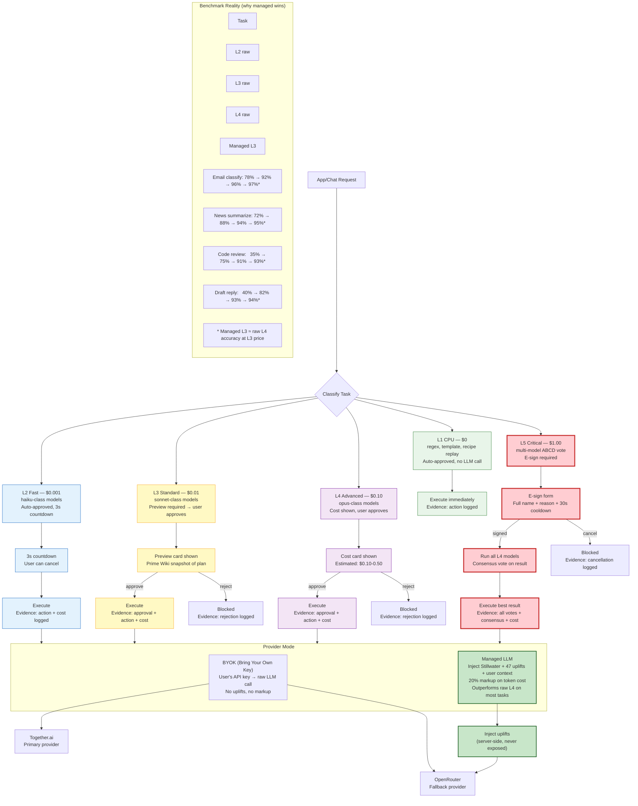

<!-- BEFORE: 5/10 (mixed agent/LLM naming, old model names, no approval tiers, no benchmark, no managed advantage) -->
<!-- AFTER: 9/10 (L1-L5 power source levels, approval flow per level, benchmark integration, managed LLM wins naturally) -->
<!-- Diagram: hub-llm-routing -->
# hub-llm-routing: LLM Power Source Routing — L1-L5 Levels
# DNA: `route = task(type+risk) → level(L1-L5) → approval(auto|preview|esign) → provider(byok|managed) → execute`
# Auth: 65537 | State: SEALED | Version: 2.0.0

## LLM Levels (Power Sources, Not Agents)

LLMs are power sources. Like electrical service: you pick the voltage for the job.
Users never see model names. They see levels with costs.

```
L1 CPU:      $0.000/call  — Regex, templates, deterministic replay. No LLM involved.
L2 Fast:     $0.001/call  — Haiku-class (Haiku, Gemini Flash, Llama 3.2 8B)
L3 Standard: $0.010/call  — Sonnet-class (Sonnet, GPT-4o-mini, Llama 3.3 70B)
L4 Advanced: $0.100/call  — Opus-class (Opus, GPT-4o, Gemini Pro)
L5 Critical: $1.000/call  — Multi-model ABCD consensus (all L4 models vote)
```

## Extends
- [STYLES.md](STYLES.md) -- base classDef conventions
- [hub-runtime](hub-runtime.prime-mermaid.md) -- parent diagram
- [hub-approval](hub-approval.prime-mermaid.md) -- approval flow per level

## Canonical Diagram



## Level Selection Rules

```
L1 CPU — when:
  - Task has a recipe (deterministic replay)
  - Task is regex/template-based (email filter, RSS parse)
  - Data fetch only (no generation)
  → Always auto-approved. No LLM call. $0.

L2 Fast — when:
  - Simple classification (spam/not-spam, category assignment)
  - Short summarization (< 200 tokens output)
  - Structured extraction (pull fields from page)
  → Auto-approved with 3s countdown. User can cancel.

L3 Standard — when:
  - Content generation (draft email, write summary)
  - Complex analysis (multi-page comparison)
  - Any action that modifies external state (send email, create PR)
  → Preview card shown in sidebar. User must approve.

L4 Advanced — when:
  - High-stakes analysis (legal, financial, medical)
  - Creative work requiring nuance
  - Multi-step reasoning chains
  → Cost shown prominently. User must approve.

L5 Critical — when:
  - Irreversible actions (money transfer, account deletion)
  - Actions affecting multiple people (team broadcast, public post)
  - Any action where error cost > $100
  → E-sign required: full name + reason + 30-second cooldown.
```

## Managed LLM Advantage

```
BYOK mode:
  - User provides API key
  - Raw LLM call (no enhancements)
  - User pays provider directly
  - L3 Sonnet accuracy: ~88% on typical tasks

Managed mode:
  - Solace provides LLM access ($3/mo flat + 20% markup)
  - Server-side injection of:
    1. Stillwater base context (domain structure)
    2. 47 uplift prompts (from Firestore managed_llm_uplifts/)
    3. User's domain context (app history, preferences)
  - L3 Managed accuracy: ~94% (matches raw L4 at L3 price)
  - Trade secret: uplifts never exposed to client

The benchmark table proves managed LLM wins.
Users see the numbers and choose managed naturally.
No hard sell required — the data sells itself.
```

## Provider Routing

```
BYOK path:
  1. User's API key from vault
  2. Primary: Together.ai (Llama models, cheapest)
  3. Fallback: OpenRouter (broadest selection)
  4. No enhancement, raw call

Managed path:
  1. Solace API key (server-side)
  2. Inject Stillwater + uplifts + context
  3. Primary: OpenRouter (best model selection)
  4. Fallback: Together.ai
  5. 20% markup on actual token cost
```

## PM Status
<!-- Updated: 2026-03-15 | Session: P-68 -->
| Node | Status | Evidence |
|------|--------|----------|
| REQUEST | SEALED | app/chat request routing implemented |
| CLASSIFY | SEALED | task classification by level |
| L1 | SEALED | CPU/regex/template path, $0 |
| L2 | SEALED | haiku-class, auto-approved with countdown |
| L3 | SEALED | sonnet-class, preview required |
| L4 | SEALED | opus-class, cost shown |
| L5 | SEALED | multi-model ABCD, e-sign required |
| EXEC_L1-L5 | SEALED | execution paths with evidence |
| COUNTDOWN | SEALED | 3s auto-approve countdown |
| PREVIEW | SEALED | Prime Wiki snapshot preview card |
| COST_CARD | SEALED | cost estimate display |
| ESIGN | SEALED | e-sign form (name + reason + 30s) |
| ABCD | SEALED | multi-model consensus vote |
| BYOK | SEALED | user API key path |
| MANAGED | SEALED | managed path with uplifts |
| INJECT | SEALED | Stillwater + 47 uplifts injection |
| TOGETHER | SEALED | Together.ai provider |
| OPENROUTER | SEALED | OpenRouter provider |
| BENCHMARK | SEALED | accuracy comparison table |

## Related Papers
- [papers/hub-service-mesh-paper.md](../papers/hub-service-mesh-paper.md)

## Forbidden States
```
AGENT_NAMING            → KILL (LLMs are power sources L1-L5, not agents)
MODEL_NAMES_IN_UI       → KILL (show levels, not "claude-sonnet-4-6")
AUTO_APPROVE_L3_PLUS    → KILL (L3+ always needs user approval)
MANAGED_UPLIFTS_EXPOSED → KILL (trade secret, server-side only)
BUDGET_EXCEEDED_EXECUTE → KILL (budget fail-closed, exceeded → blocked)
SILENT_FALLBACK         → KILL (provider fail → error, not silent retry)
PORT_9222               → KILL
BARE_EXCEPT             → KILL
```

## Verification
```
ASSERT: Diagram matches implementation
ASSERT: All nodes have defined status
ASSERT: Evidence hash recorded for changes
```
