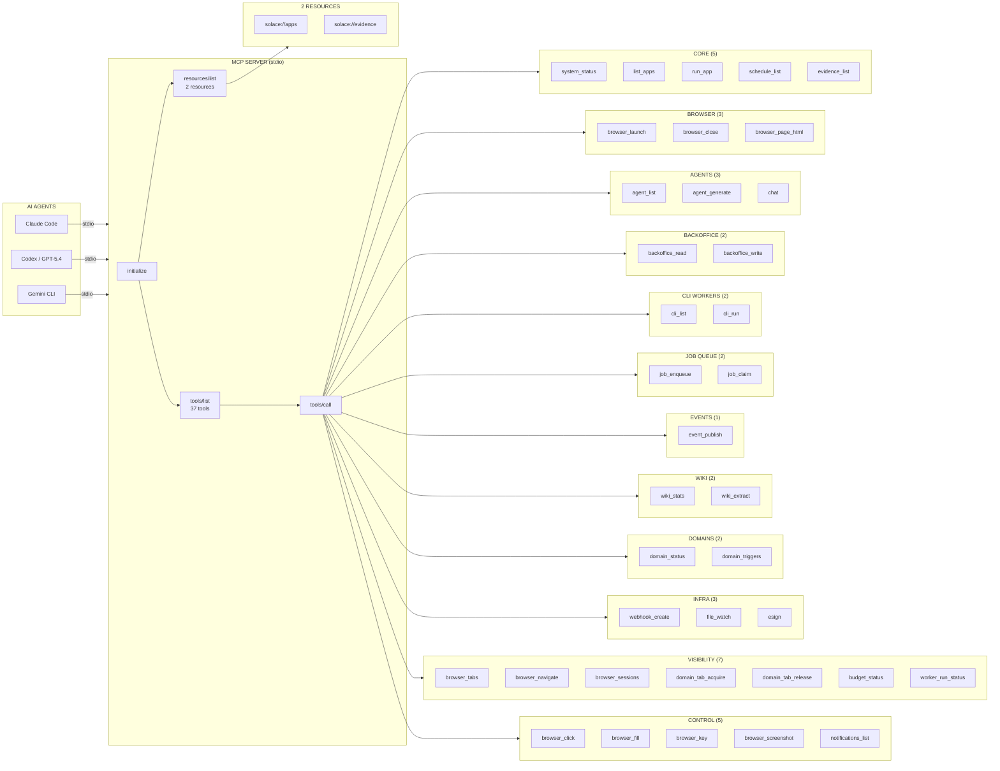

<!-- Diagram: 23-mcp-agent-interface -->
# 23: MCP Agent Interface — 37 Tools + 2 Resources
# DNA: `mcp = tools/list(37) → tools/call → resources/read; agents discover capabilities at runtime`
# Auth: 65537 | State: SEALED | Version: 3.0.0


## Extends
- [STYLES.md](STYLES.md) — base classDef conventions
- [hub-runtime](hub-runtime.prime-mermaid.md) — parent diagram

## Canonical Diagram



## PM Status
<!-- Updated: 2026-03-22 | Session: P-76 | GLOW 759 -->
| Node | Status | Evidence |
|------|--------|----------|
| CLAUDE | SEALED | Claude Code MCP client integration tested P-76 |
| CODEX | SEALED | Codex MCP client via stdio tested |
| GEMINI | SEALED | Gemini CLI MCP client via stdio tested |
| INIT (initialize) | SEALED | MCP initialize handler in mcp.rs |
| TOOLS (tools/list) | SEALED | 37 tools listed in mcp.rs |
| RESOURCES (resources/list) | SEALED | 2 resources listed in mcp.rs |
| CALL (tools/call) | SEALED | Tool dispatch in mcp.rs — 37 match arms |
| T1 (system_status) | SEALED | Returns uptime, sessions, app count, cloud, theme |
| T2 (list_apps) | SEALED | Returns all 87 installed apps |
| T3 (run_app) | SEALED | Executes app via app_engine::runner, fixed structuredContent |
| T4 (schedule_list) | SEALED | Returns 9 cron schedules |
| T5 (evidence_list) | SEALED | Returns hash-chained evidence entries |
| T6 (browser_launch) | SEALED | Creates session with pid, profile, url |
| T7 (browser_close) | SEALED | Closes session by ID, returns profile |
| T8 (browser_page_html) | SEALED | Returns live page HTML or text_only |
| T9 (agent_list) | SEALED | Detects claude, codex, gemini on PATH |
| T10 (agent_generate) | SEALED | Invokes agent with prompt, model, timeout |
| T11 (chat) | SEALED | Preview mode with route selection |
| T12 (backoffice_read) | SEALED | Reads via crud::select_list from SQLite |
| T13 (backoffice_write) | SEALED | Inserts via crud::insert + publishes event |
| T14 (cli_list) | SEALED | Lists 7 CLI workers with installed status |
| T15 (cli_run) | SEALED | Executes allowlisted CLI commands |
| T16 (job_enqueue) | SEALED | Enqueues to SQLite job queue with evidence_hash |
| T17 (job_claim) | SEALED | Atomic claim (SELECT+UPDATE in transaction) |
| T18 (event_publish) | SEALED | Publishes to EventBus + SQLite persistence |
| T19 (wiki_stats) | SEALED | Returns snapshot_count, total_size, codecs |
| T20 (wiki_extract) | SEALED | Extracts via stillwater::extract, returns codec+sha256 |
| T21 (domain_status) | SEALED | Returns apps, OAuth3 status, wiki snapshots |
| T22 (domain_triggers) | SEALED | Matches URL patterns to app triggers |
| T23 (webhook_create) | SEALED | Creates webhook in webhooks.json |
| T24 (file_watch) | SEALED | Creates watcher in watchers.json |
| T25 (esign) | SEALED | E-signs with evidence::record_event |
| T26 (browser_tabs) | SEALED | Returns open tabs from AppState::browser_tabs |
| T27 (browser_navigate) | SEALED | WebSocket relay only — no browser spawning |
| T28 (browser_sessions) | SEALED | Returns active sessions from AppState |
| T29 (domain_tab_acquire) | SEALED | 1-tab-per-domain lock with conflict detection |
| T30 (domain_tab_release) | SEALED | Releases domain tab back to Idle |
| T31 (budget_status) | SEALED | Fail-closed budget enforcement |
| T32 (worker_run_status) | SEALED | Live step progress from AppState::worker_run |
| T33 (browser_click) | SEALED | WebSocket relay to sidebar (no xdotool) |
| T34 (browser_fill) | SEALED | WebSocket relay with submit option |
| T35 (browser_key) | SEALED | WebSocket relay for key presses |
| T36 (browser_screenshot) | SEALED | Returns screenshot directory stats |
| T37 (notifications_list) | SEALED | Returns read/unread notification counts |
| R1 (solace://apps) | SEALED | Apps resource in mcp.rs |
| R2 (solace://evidence) | SEALED | Evidence resource in mcp.rs |

## Covered Files
```
code:
  - solace-browser/solace-runtime/src/mcp.rs (25 tool handlers)
  - solace-browser/solace-runtime/src/state.rs (AppState with backoffice_db, event_bus, job_queue)
  - solace-browser/solace-runtime/src/backoffice/crud.rs (CRUD operations)
  - solace-browser/solace-runtime/src/job_queue.rs (SQLite job queue)
  - solace-browser/solace-runtime/src/pubsub.rs (EventBus)
  - solace-browser/solace-runtime/src/evidence.rs (hash-chained evidence)
  - solace-browser/solace-runtime/src/pzip/stillwater.rs (wiki extraction)
specs:
  - specs/hub/diagrams/hub-mcp.prime-mermaid.md (this file)
```

## Tool Categories
| Category | Tools | Count |
|----------|-------|-------|
| Core | system_status, list_apps, run_app, schedule_list, evidence_list | 5 |
| Browser | browser_launch, browser_close, browser_page_html | 3 |
| Agents | agent_list, agent_generate, chat | 3 |
| Backoffice | backoffice_read, backoffice_write | 2 |
| CLI Workers | cli_list, cli_run | 2 |
| Job Queue | job_enqueue, job_claim | 2 |
| Events | event_publish | 1 |
| Wiki | wiki_stats, wiki_extract | 2 |
| Domains | domain_status, domain_triggers | 2 |
| Infrastructure | webhook_create, file_watch, esign | 3 |
| Visibility | browser_tabs, browser_navigate, browser_sessions, domain_tab_acquire, domain_tab_release, budget_status, worker_run_status | 7 |
| Control | browser_click, browser_fill, browser_key, browser_screenshot, notifications_list | 5 |
| **Total** | | **37** |

## Related Papers
- [papers/hub-sidebar-paper.md](../papers/hub-sidebar-paper.md)

## Forbidden States
```
PORT_9222              → KILL
COMPANION_APP_NAMING   → KILL (use "Solace Hub")
SILENT_FALLBACK        → KILL
PYTHON_DEPENDENCY      → KILL (pure Rust)
TOOL_WITHOUT_HANDLER   → KILL (every tool definition must have a match arm)
XDOTOOL_IN_MCP         → KILL (browser control via WebSocket relay only)
BROWSER_SPAWN_FROM_MCP → KILL (navigate via sidebar relay, never spawn new windows)
```

## Verification
```
ASSERT: 37 tools in mcp_tool_definitions() == 37 match arms in handle_tools_call()
ASSERT: All HTTP routes have corresponding MCP tools
ASSERT: All nodes have SEALED status
ASSERT: Evidence hash recorded for write operations (backoffice, jobs, events, esign)
ASSERT: Security allowlist enforced for cli_run
```

## LEAK Interactions
- Calls: backoffice CRUD, job queue, event bus, evidence chain, wiki extraction
- Orchestrates with: all Solace apps via run_app, CLI tools via cli_run, AI agents via agent_generate
- Pattern: input → process → output → evidence
- Infrastructure: webhooks trigger on events, file_watch triggers apps, esign provides FDA Part 11 compliance
