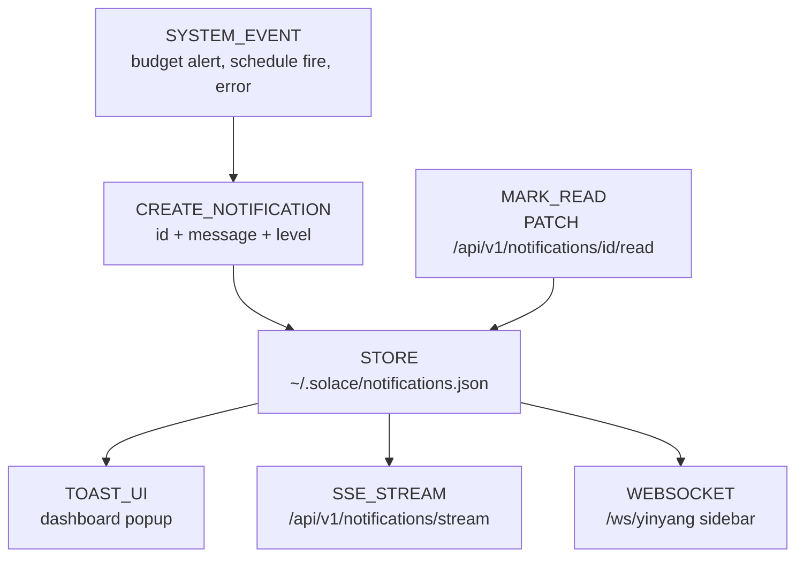

<!-- Diagram: 31-notifications-system -->
# 31: Notifications — Toast + SSE + Push
# SHA-256: aa053b42fc484155571d9299ef3578c88d26d70aa4ac17f83dbe9db8ca9298f8
# DNA: notification = create(message) to store(json) to deliver(toast+sse+ws)
# Auth: 65537 | State: SEALED | Version: 1.0.0


## Extends
- [STYLES.md](STYLES.md) — base classDef conventions
- [hub-runtime](hub-runtime.prime-mermaid.md) — parent diagram

## Canonical Diagram



## PM Status
<!-- Updated: 2026-03-14 | Session: P-67 -->
| Node | Status | Evidence |
|------|--------|----------|
| EVENT (SYSTEM_EVENT) | SEALED | System events trigger notifications in Rust runtime (solace-runtime) |
| CREATE (CREATE_NOTIFICATION) | SEALED | _append_notification with id + message + level |
| STORE | SEALED | ~/.solace/notifications.json persistence |
| TOAST (TOAST_UI) | SEALED | Dashboard toast popup in notifications routes |
| SSE (SSE_STREAM) | SEALED | /api/v1/notifications/stream SSE endpoint |
| WS (WEBSOCKET) | SEALED | /ws/yinyang sidebar WebSocket delivery |
| READ (MARK_READ) | SEALED | PATCH /api/v1/notifications/{id}/read endpoint |

## Covered Files
```
code:
  - solace-browser/solace-runtime/src/routes/notifications.rs
services:
  - localhost:8888/api/v1/notifications
  - localhost:8888/api/v1/notifications/stream
```

## Related Papers
- [papers/hub-sidebar-paper.md](../papers/hub-sidebar-paper.md)

## Forbidden States
```
PORT_9222              → KILL
COMPANION_APP_NAMING   → KILL (use "Solace Hub")
SILENT_FALLBACK        → KILL
PYTHON_DEPENDENCY      → KILL (pure Rust)
```

## Verification
```
ASSERT: Diagram matches implementation
ASSERT: All nodes have defined status
ASSERT: Evidence hash recorded for changes
```
