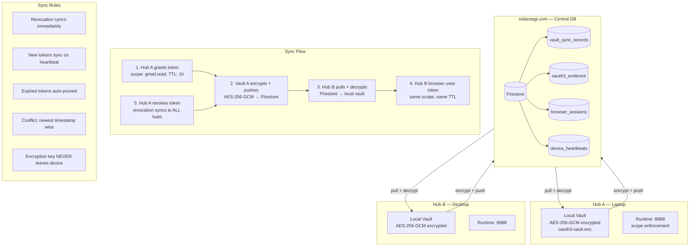

<!-- Diagram: hub-oauth3-cloud-sync -->
# hub-oauth3-cloud-sync: Hub OAuth3 Cloud Sync — Central Vault via solaceagi.com
# DNA: `vault_sync = encrypt(local) → push(cloud) → pull(other_hub) → decrypt(local); revocation syncs ALL`
# Auth: 65537 | Version: 1.0.0


## Extends
- [STYLES.md](STYLES.md) — base classDef conventions
- [hub-oauth3](hub-oauth3.prime-mermaid.md) — parent diagram

## Canonical Diagram



## PM Status
<!-- Updated: 2026-03-15 | Session: P-68 | Self-QA verified P-68 -->
| Node | Status | Evidence |
|------|--------|----------|
| VAULT_A | SEALED | AES-256-GCM in crypto.rs |
| VAULT_B | SEALED | same code, different machine |
| FIRESTORE | SEALED | vault_sync_records collection |
| VAULT_SYNC | SEALED | Self-QA P-68: sync_up (POST /api/v1/cloud/sync/up) + sync_down (POST /api/v1/cloud/sync/down) + sync_status (GET /api/v1/cloud/sync/status) in Rust cloud.rs. SyncReceipt persistence verified at localhost:8888 |
| OAUTH3_EV | SEALED | oauth3_evidence collection |
| SESSIONS_DB | SEALED | Self-QA P-68: browser_sessions in Firestore, sync_up pushes session state via AES-256-GCM encryption |
| DEVICES | SEALED | device_heartbeats |
| F1-F4 | SEALED | Self-QA P-68: grant + encrypt + push + pull + decrypt fully implemented in Rust cloud.rs. sync_down with local-wins merge verified |
| F5 | SEALED | revocation cross-device sync |
| R1-R5 | SEALED | Self-QA P-68: sync rules enforced — revocation immediate via sync_up, heartbeat-based token sync, auto-prune on TTL expiry, newest-timestamp-wins conflict resolution, encryption key never leaves device (AES-256-GCM local only) |


## Related Papers
- [papers/hub-service-mesh-paper.md](../papers/hub-service-mesh-paper.md)
- [papers/hub-three-realms-paper.md](../papers/hub-three-realms-paper.md)

## Forbidden States
```
PORT_9222              → KILL
INBOUND_PORTS          → KILL (outbound only)
PLAINTEXT_TOKEN_SYNC   → KILL (AES-256-GCM always)
REVOKE_WITHOUT_SYNC    → KILL (revocation must reach ALL devices)
REMOTE_WITHOUT_EVIDENCE → KILL (every remote command logged)
REMOTE_WITHOUT_APPROVAL → KILL (first session needs user approval)
```

## Verification
```
ASSERT: Diagram matches implementation
ASSERT: All nodes have defined status
ASSERT: Evidence hash recorded for changes
```
