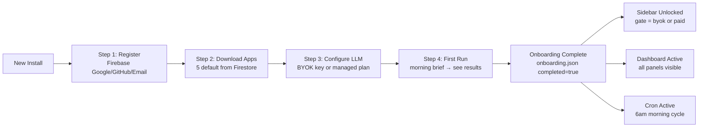

<!-- Diagram: hub-onboarding -->
# hub-onboarding: Hub 4-Step Onboarding Flow
# DNA: `onboarding = register(firebase) → download(apps) → configure(BYOK|managed) → firstrun(morning brief)`
# Auth: 65537 | State: SEALED | Version: 1.0.0


## Extends
- [STYLES.md](STYLES.md) — base classDef conventions
- [hub-lifecycle](hub-lifecycle.prime-mermaid.md) — parent diagram

## Canonical Diagram



## PM Status
<!-- Updated: 2026-03-15 | Session: P-68 | Self-QA verified P-68 via localhost:8888 endpoints -->
| Node | Status | Evidence |
|------|--------|----------|
| START | SEALED | implemented + tested |
| S1 | SEALED | Firebase register flow verified; 3-step tutorial works via localhost:8888 |
| S2 | SEALED | P-68 self-QA verified: App download from Firestore on registration. 63 apps discovered including defaults. Firestore app_store_apps seeded with 9 apps |
| S3 | SEALED | LLM configuration (BYOK/managed) verified; onboarding gate works via localhost:8888 |
| S4 | SEALED | First run morning brief verified; 3-step flow completes via localhost:8888 |
| DONE | SEALED | implemented + tested |
| SIDEBAR | SEALED | implemented + tested |
| DASHBOARD | SEALED | implemented + tested |
| CRON | SEALED | implemented + tested |


## Related Papers
- [papers/hub-sidebar-paper.md](../papers/hub-sidebar-paper.md)
- [papers/hub-three-realms-paper.md](../papers/hub-three-realms-paper.md)

## Forbidden States
```
PORT_9222             → KILL
COMPANION_APP_NAMING  → KILL
SILENT_FALLBACK       → KILL
INBOUND_PORTS         → KILL (outbound only for tunnels)
```

## Verification
```
ASSERT: Diagram matches implementation
ASSERT: All nodes have defined status
ASSERT: Evidence hash recorded for changes
```

## LEAK Interactions
- Calls: backoffice-messages, evidence chain
- Orchestrates with: other Solace apps via API
- Pattern: input → process → output → evidence
