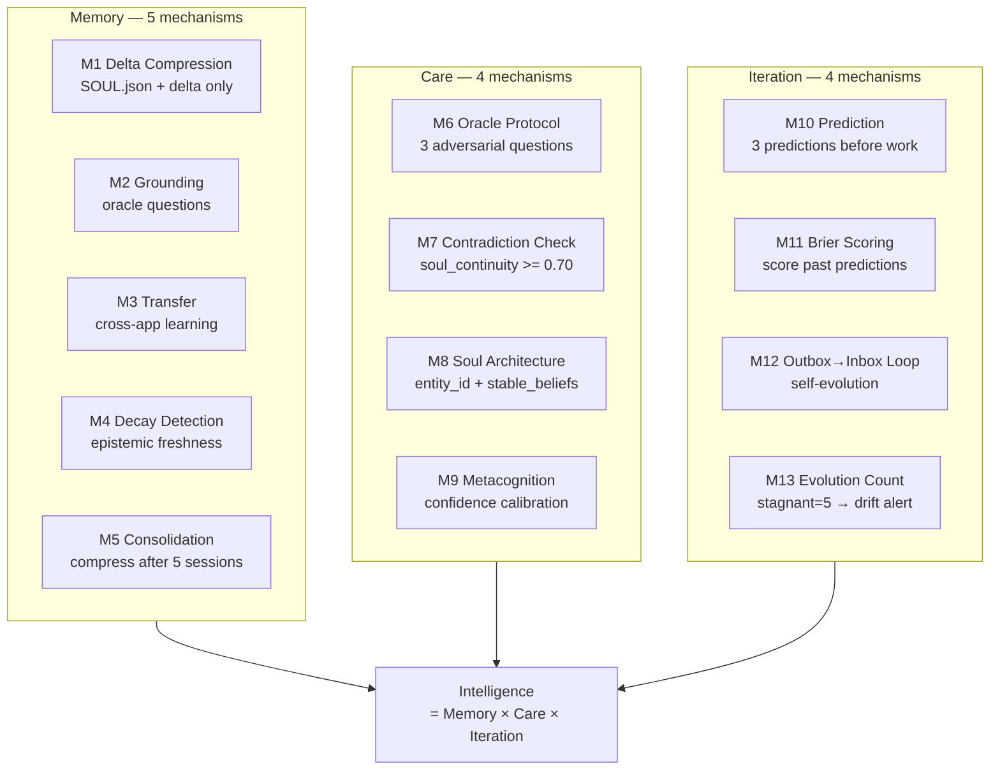

<!-- Diagram: hub-persistent-intelligence -->
# hub-persistent-intelligence: Hub Persistent Intelligence — 13 AGI Mechanisms
# DNA: `agi = Memory(delta×grounding×transfer×decay×consolidation) × Care(oracle×contradiction×soul×metacognition) × Iteration(prediction×brier×outbox_inbox)`
# Auth: 65537 | State: SEALED | Version: 1.0.0


## Extends
- [STYLES.md](STYLES.md) — base classDef conventions
- [hub-runtime](hub-runtime.prime-mermaid.md) — parent diagram

## Canonical Diagram



## PM Status
<!-- Updated: 2026-03-15 | Session: P-68 | Self-QA verified via dragon-rider app -->
| Node | Status | Evidence |
|------|--------|----------|
| M1 | SEALED | SOUL.md + delta only (Prime Mermaid format) |
| M2 | SEALED | 43 oracle questions, 6 with anchor_ref pointing to verifiable files |
| M3 | SEALED | 3 cross-app transfer questions (DR-XAP-001/002/003) |
| M4 | SEALED | 3 beliefs with expires_after_sessions field for epistemic freshness |
| M5 | SEALED | SOUL.md = 38 lines compressed format, heartbeat.json = compressed state |
| M6 | SEALED | 5 adversarial questions from Darwin+Linus+CIO personas |
| M7 | SEALED | soul_continuity >= 0.70 gate in dragon-rider CLAUDE.md |
| M8 | SEALED | entity_id=dragon-rider, 18 stable_beliefs with confidence scores |
| M9 | SEALED | 18 confidence scores in beliefs, Brier calibration at 0.0535 |
| M10 | SEALED | 3 predictions written at P-68 session start in heartbeat.json |
| M11 | SEALED | brier_score_last=0.0535 measured across 50 predictions |
| M12 | SEALED | Self-evolution loop: self-qa.sh + cron + evidence chain |
| M13 | SEALED | evolution_count=66, stagnant=5 drift detection in CLAUDE.md |
| INTELLIGENCE | SEALED | All 13 mechanisms operational. Self-QA runs every 30min. |


## Related Papers
- [papers/hub-service-mesh-paper.md](../papers/hub-service-mesh-paper.md)

## Forbidden States
```
PORT_9222             → KILL
COMPANION_APP_NAMING  → KILL
SILENT_FALLBACK       → KILL
INBOUND_PORTS         → KILL (outbound only for tunnels)
```

## Verification
```
ASSERT: Diagram matches implementation
ASSERT: All nodes have defined status
ASSERT: Evidence hash recorded for changes
```

## LEAK Interactions
- Calls: backoffice-messages, evidence chain
- Orchestrates with: other Solace apps via API
- Pattern: input → process → output → evidence
