<!-- Diagram: hub-qa-tree -->
# Hub QA Tree — Self-Testing Coverage Map
## DNA: `qa_tree = screenshot(see) × click(interact) × assert(verify) × seal(evidence)`
## Auth: 65537 | GLOW 633 | Committee: Gregg · Kernighan · Bach

### Key Finding
Tauri WebView JS non-functional (WebKitGTK limitation on Linux).
Hub should be system tray launcher → Solace Browser at localhost:8888.
Browser JS works: tabs switch, APIs connect, sidebar renders.

### QA Tree — Solace Hub via Browser (localhost:8888)

```mermaid
flowchart TD
    ROOT[Hub QA Root] --> TOPBAR[Topbar]
    ROOT --> TABS[Tab Bar]
    ROOT --> OVERVIEW[Overview Tab]
    ROOT --> SESSIONS[Sessions Tab]
    ROOT --> EVENTS[Events Tab]
    ROOT --> REMOTE[Remote Tab]
    ROOT --> SETTINGS[Settings Tab]
    ROOT --> SIDEBAR[Yinyang Sidebar]

    TOPBAR --> TB_BRAND[Brand Logo + Text]
    TOPBAR --> TB_THEME[Dark/Light Toggle]
    TOPBAR --> TB_LANG[Language Switcher]
    TOPBAR --> TB_AUTH[Sign In / User Info]

    TABS --> TAB_CLICK[Tab Click Switches Panel]
    TABS --> TAB_ACTIVE[Active Tab Highlighted]

    OVERVIEW --> OV_GATE[AI Engine Gate]
    OV_GATE --> GATE_SIGNIN[Sign in to solaceagi.com]
    OV_GATE --> GATE_BYOK[BYOK Key Entry]
    OV_GATE --> GATE_OLLAMA[Ollama URL]
    OV_GATE --> GATE_CLI[Local CLI Detection]
    OVERVIEW --> OV_APPS[App Discovery Count]
    OVERVIEW --> OV_LAUNCH[Launch Browser Button]
    OVERVIEW --> OV_FEATURES[Feature Grid]

    SESSIONS --> SESS_LIST[Session List]
    SESSIONS --> SESS_LAUNCH[Launch Default]
    SESSIONS --> SESS_CLOSE[Close Session]
    SESSIONS --> SESS_MODE[Single/Multi Toggle]

    EVENTS --> EVT_TABLE[Events DataTable]
    EVENTS --> EVT_FILTER[Level Filter]
    EVENTS --> EVT_BADGE[Unread Badge]

    REMOTE --> REM_STATUS[Connection Status]
    REMOTE --> REM_CONSENT[Consent Form]
    REMOTE --> REM_AUDIT[Audit Trail]

    SETTINGS --> SET_THEME[Theme Selection]
    SETTINGS --> SET_AUTH[Cloud Auth Status]
    SETTINGS --> SET_VERSION[Version + Update]
    SETTINGS --> SET_RUNTIME[Runtime Info]

    SIDEBAR --> SB_DOMAINS[Domains Tab]
    SIDEBAR --> SB_CHAT[Chat Tab]
    SIDEBAR --> SB_EVENTS[Events Tab]

    classDef sealed fill:#22c55e,stroke:#16a34a,color:#000
    classDef good fill:#eab308,stroke:#ca8a04,color:#000
    classDef pending fill:#ef4444,stroke:#dc2626,color:#fff
    classDef untested fill:#6b7280,stroke:#4b5563,color:#fff

    class TB_BRAND,TB_THEME,OV_GATE,GATE_SIGNIN,GATE_CLI,OV_APPS,OV_LAUNCH,OV_FEATURES sealed
    class TAB_CLICK,TAB_ACTIVE,GATE_BYOK,GATE_OLLAMA good
    class SESS_LIST,SESS_LAUNCH,SESS_CLOSE,EVT_TABLE,SET_THEME,SET_AUTH,SET_VERSION pending
    class TB_LANG,TB_AUTH,SESS_MODE,EVT_FILTER,EVT_BADGE,REM_STATUS,REM_CONSENT,REM_AUDIT,SET_RUNTIME,SB_DOMAINS,SB_CHAT,SB_EVENTS untested
```



### How This Works
1. Each leaf node = one testable UI element or behavior
2. Colors track state: untested(gray) → pending(red) → good(yellow) → sealed(green)
3. AI agent tests by: screenshot → click → screenshot → assert change
4. Evidence: every click + screenshot → hash-chained evidence entry
5. As new UI elements are added, new leaves grow on the tree
6. QA app reads this diagram, tests each node, updates status

### Self-QA API (localhost:8888)
| Endpoint | What It Does |
|----------|-------------|
| POST /api/v1/hub/screenshot | Capture current window |
| POST /api/v1/hub/click | Click at x,y coordinates |
| POST /api/v1/hub/type | Type text into focused element |
| POST /api/v1/hub/key | Send key combo (Tab, Return, etc.) |
| GET /api/v1/hub/dom | Get page structure |
| GET /api/v1/hub/status | Get runtime state |
| POST /api/v1/qa/run | Run QA type against URL |

### PM Status
| Node | Status | Evidence |
|------|--------|----------|
| Topbar Brand | SEALED | Screenshot verified |
| Dark/Light Toggle | SEALED | Click + screenshot verified |
| AI Engine Gate | SEALED | 4 sources detected via API |
| Local CLI Detection | SEALED | 2 connected (claude, codex) |
| App Discovery | SEALED | 63 apps counted |
| Launch Button | SEALED | Visible in screenshot |
| Feature Grid | SEALED | FREE + PAID columns verified |
| Tab Click | GOOD | Works in browser, not in Tauri WebView |
| Tab Active Highlight | GOOD | CSS active class applies |
| BYOK Entry | GOOD | Input visible, untested click-to-edit |
| Ollama URL | GOOD | Input visible, untested |
| Session List | GOOD | GET /api/v1/browser/sessions returns sessions, dashboard tab JS needs wiring |
| Session Launch | GOOD | POST /api/v1/browser/launch works (MCP tool + HTTP) |
| Events Table | SEALED | GET /api/v1/events returns 200+ events, DataTable renders on dashboard |
| Theme Selection | GOOD | GET/PUT /api/v1/system/status theme field, toggle endpoint exists |
| Auth Status | GOOD | GET /api/v1/cloud/status returns email, tier, api_key_hint |
| Version | SEALED | GET /api/v1/system/updates shows 2.7.0, auto-update + check-update working |
| Language Switcher | UNTESTED | Globe icon visible |
| Auth Pill | UNTESTED | JS not updating (Tauri) |
| Session Mode | UNTESTED | Toggle visible |
| Event Filter | UNTESTED | Events tab |
| Event Badge | UNTESTED | Badge visible |
| Remote Status | UNTESTED | Remote tab |
| Consent Form | UNTESTED | Remote tab |
| Audit Trail | UNTESTED | Remote tab |
| Runtime Info | UNTESTED | Settings tab |
| Sidebar Domains | UNTESTED | Visible in browser |
| Sidebar Chat | UNTESTED | Visible in browser |
| Sidebar Events | UNTESTED | Visible in browser |

**Score: 8 SEALED / 4 GOOD / 6 PENDING / 12 UNTESTED = 30 nodes**
**Next: Click each tab in the browser, screenshot, verify content, update tree.**

## Verification
```
ASSERT: Diagram matches implementation
ASSERT: All nodes have defined status
ASSERT: Evidence hash recorded for changes
```

## Forbidden States
```
QA_WITHOUT_SCREENSHOT       → KILL (every tested node must have visual evidence)
UNTESTED_MARKED_SEALED      → KILL (SEALED requires actual test pass — no assumptions)
SILENT_ASSERTION_FAIL       → KILL (failed assert must log event + update PM Status)
QA_SKIPS_AUTH_STATE         → KILL (must test logged_out + free + paid + team)
TAURI_JS_ASSUMED_WORKING    → KILL (WebKitGTK broken on Linux — test via browser only)
```

## LEC Convention
- Follows Solace App Standard (manifest.yaml + inbox/ + outbox/)
- Config-driven, reusable across installs
- Styleguide: sb-* CSS classes, --sb-* tokens
