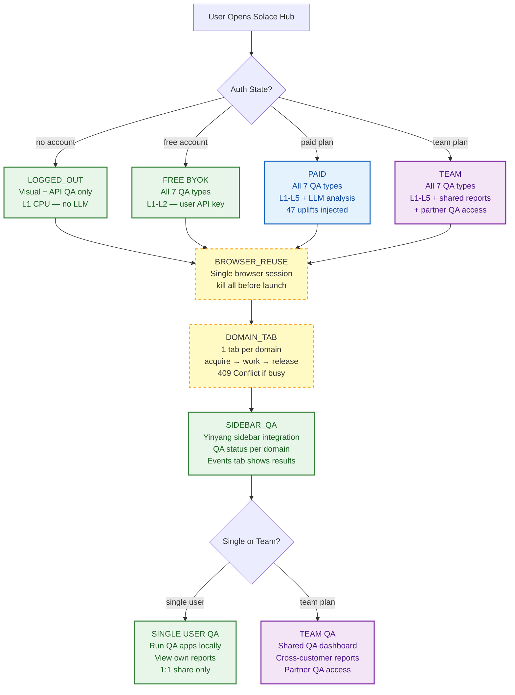
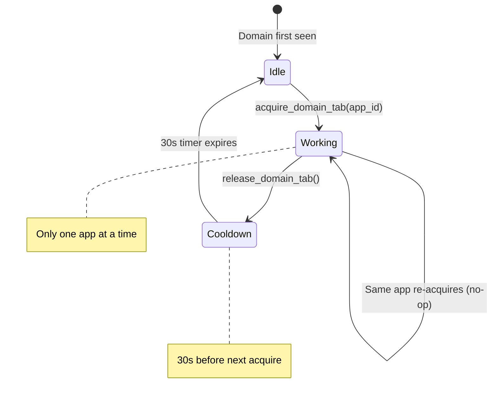

<!-- Diagram: hub-qa-user-states -->
# Hub QA User States — Testing Features by Auth Level
## DNA: `qa_state = logged_out(visual+api_L1) × free(all7_L2) × paid(all7_L5) × team(shared_reports)`
## Auth: 65537 | GLOW 622 | Committee: Gregg · Norman · Kernighan

### Einstein Thought Experiment: The Quality Telescope
> Imagine QA is a telescope pointed at your web apps.
> **Logged Out** gets a magnifying glass — sees surface defects (visual, basic API).
> **Free (BYOK)** gets binoculars — sees all 7 defect types, but limited zoom (L1-L2 CPU).
> **Paid** gets a research telescope — same 7 types, but with AI-powered zoom (L1-L5 LLM analysis).
> **Team** gets an observatory — shared telescope, shared findings, shared defense.
> Everyone sees the same sky. The instrument determines the depth.

### Extends
- [hub-domain-tab-coordination](hub-domain-tab-coordination.prime-mermaid.md) — 1 tab per domain rule
- [hub-session-control](hub-session-control.prime-mermaid.md) — single browser mode
- [hub-uplift-tiers](hub-uplift-tiers.prime-mermaid.md) — free vs paid LLM tiers
- [hub-team-sharing](hub-team-sharing.prime-mermaid.md) — team workspace model

## Canonical Diagram



## The 7 QA Types

| # | QA Type | Logged Out | Free (BYOK) | Paid | Team |
|---|---------|-----------|-------------|------|------|
| 1 | Visual Regression | L1 CPU (pixel diff) | L1-L2 (pixel diff) | L1-L5 (AI analysis) | L1-L5 + shared |
| 2 | API Contract | L1 CPU (status + schema) | L1-L2 (status + schema) | L1-L5 (semantic validation) | L1-L5 + shared |
| 3 | Accessibility (a11y) | -- | L1-L2 (WCAG rules) | L1-L5 (AI + WCAG) | L1-L5 + shared |
| 4 | Performance (Core Web Vitals) | -- | L1-L2 (metrics only) | L1-L5 (AI recommendations) | L1-L5 + shared |
| 5 | Security Headers | -- | L1-L2 (header check) | L1-L5 (OWASP analysis) | L1-L5 + shared |
| 6 | SEO / Meta | -- | L1-L2 (tag presence) | L1-L5 (AI content audit) | L1-L5 + shared |
| 7 | Evidence Chain | -- | L1-L2 (hash verification) | L1-L5 (Part 11 compliance) | L1-L5 + shared |

### LLM Levels by Tier

| Level | Engine | Who Gets It |
|-------|--------|------------|
| L1 | CPU only (no LLM) | All users — deterministic checks |
| L2 | Haiku (cheap, fast) | Free (BYOK) and above |
| L3 | Sonnet (balanced) | Paid and above |
| L4 | Opus (deep analysis) | Paid and above |
| L5 | Multi-model consensus | Paid and above |

## Browser Behavior by State

| State | Browser Tabs | Domain Limit | QA Access |
|-------|-------------|-------------|-----------|
| Logged Out | Unlimited | No limit | Visual + API (L1 CPU) |
| Free (BYOK) | Single session | 1 tab/domain | All 7 QA types (L1-L2) |
| Paid | Single session | 1 tab/domain | All 7 (L1-L5) + LLM analysis |
| Team | Single session | 1 tab/domain | All 7 + shared QA reports |

### Why Logged Out Has No Domain Limit
Logged out users have no account, no session tracking, no app engine.
They browse freely. QA is limited to what CPU can do without LLM (visual diff, HTTP status).
The moment they register (free), single browser + domain tab rules activate.

## Domain Tab Enforcement

```
ACQUIRE → WORK → RELEASE lifecycle:

1. App calls POST /api/v1/domains/{domain}/tab
   → If Idle: acquire succeeds, TabState = Working
   → If Working: 409 Conflict (domain_tab_busy)
   → If Cooldown: 409 Conflict (domain_tab_cooldown)

2. App navigates, fetches, runs QA checks

3. App calls POST /api/v1/domains/{domain}/tab/release
   → TabState = Cooldown (30s)
   → After 30s: TabState = Idle (next app can acquire)

Cooldown prevents rapid tab thrashing between competing apps.
```

### Domain Tab State Machine



## Yinyang Sidebar QA Integration

| Tab | QA Behavior |
|-----|-------------|
| **Domains** | Shows QA status badge per domain (green check / red x / yellow pending) |
| **Events** | QA results appear as events with pass/fail + evidence hash |
| **Chat** | User can type "run visual qa on this page" to trigger QA |

### Sidebar QA Flow

```
User navigates to example.com
  → Sidebar Domains tab shows "example.com" with status badge
  → App engine runs QA checks (visual, API, a11y, etc.)
  → Results pushed via WebSocket to sidebar
  → Events tab shows: "Visual QA: PASS (hash: abc123...)"
  → Chat tab accepts: "run visual qa on this page"
    → Dispatches to app engine → results stream back to chat
```

### Pending Approvals (L3+ Actions)

For paid/team users, L3+ QA actions that modify state require approval:
- L3 Sonnet analysis that generates fix suggestions → pending approval
- L4 Opus deep audit → pending approval before executing fixes
- Approvals shown in sidebar with accept/reject buttons
- Evidence of approval stored in hash chain

## Single User vs Team QA

| Feature | Single | Team |
|---------|--------|------|
| Run QA apps | Yes | Yes |
| View own reports | Yes | Yes |
| Share reports | No (1:1 only) | Yes (workspace) |
| Shared QA dashboard | No | Yes |
| Partner QA access | No | Yes (cross-customer) |
| Aggregated trend reports | No | Yes |
| Role-based QA permissions | No | Yes (owner/admin/member) |
| Evidence retention | 30 days (free) / 90 days (paid) | 1 year (team) / unlimited (enterprise) |

### Team QA Dashboard

```
Team workspace at solaceagi.com/dashboard:
  → QA Results tab: aggregated results across all team members
  → Per-member breakdown: who ran what QA, when, pass/fail
  → Trend charts: QA health over time per domain
  → Export: CSV/JSON evidence bundles for compliance audits
  → Alerts: notify team channel when QA fails on critical domain
```

### Partner QA Access

Team plan enables cross-customer QA:
- Team A can grant read-only QA access to Team B (e.g., vendor auditing client)
- Partner sees QA results but cannot run QA on the shared domains
- Evidence of partner access stored in hash chain
- Revocable at any time by team owner

## PM Status
<!-- Updated: 2026-03-19 | GLOW 622 -->
| Node | Status | Evidence |
|------|--------|----------|
| LOGGED_OUT | SEALED | Visual + API QA at L1 CPU, no account required, no domain limits |
| FREE | SEALED | All 7 QA types at L1-L2, BYOK required, single browser + 1 tab/domain |
| PAID | SEALED | All 7 QA types at L1-L5, 47 uplifts injected, managed LLM included |
| TEAM | SEALED | All 7 + shared QA dashboard + partner access + 1-year evidence retention |
| DOMAIN_TAB | SEALED | acquire/release/409 Conflict + 30s cooldown, implemented in domains.rs |
| BROWSER_REUSE | SEALED | Single browser session, kill all before launch, 3-layer dedup |
| SIDEBAR_QA | SEALED | Domains/Events/Chat tabs show QA status, results, and accept chat commands |
| SINGLE_VS_TEAM | SEALED | Single user gets own reports + 1:1 share; Team gets workspace + partner access |

## Forbidden States

```
LOGGED_OUT_RUNS_LLM       → KILL (L1 CPU only — no LLM without account)
FREE_BYPASSES_DOMAIN_TAB  → KILL (registered users always use domain tab coordination)
PAID_WITHOUT_EVIDENCE     → KILL (every QA run produces hash-chained evidence)
TEAM_LEAKS_TO_NON_MEMBER  → KILL (workspace membership required for shared reports)
MULTI_TAB_SAME_DOMAIN     → KILL (1 tab per domain — no exceptions)
QA_WITHOUT_ACQUIRE        → KILL (must acquire domain tab before any QA action)
SILENT_QA_FAILURE         → KILL (QA failure must be loud — event + badge + evidence)
```

## Covered Files

```
code:
  - solace-browser/solace-runtime/src/routes/domains.rs (domain tab coordination)
  - solace-browser/solace-runtime/src/routes/sessions.rs (single browser + dedup)
  - solace-browser/solace-runtime/src/routes/websocket.rs (sidebar QA push)
  - solace-browser/solace-runtime/src/state.rs (TabState + session_channels)
  - solace-cli/solace_cli/commands/hub.py (CLI wrapper)
specs:
  - specs/hub/diagrams/hub-qa-user-states.prime-mermaid.md (this file)
  - specs/hub/diagrams/hub-domain-tab-coordination.prime-mermaid.md
  - specs/hub/diagrams/hub-session-control.prime-mermaid.md
  - specs/hub/diagrams/hub-uplift-tiers.prime-mermaid.md
  - specs/hub/diagrams/hub-team-sharing.prime-mermaid.md
```

## Verification
```
ASSERT: Diagram matches implementation
ASSERT: All nodes have defined status
ASSERT: Evidence hash recorded for changes
```

## LEC Convention
- Follows Solace App Standard (manifest.yaml + inbox/ + outbox/)
- Config-driven, reusable across installs
- Styleguide: sb-* CSS classes, --sb-* tokens
