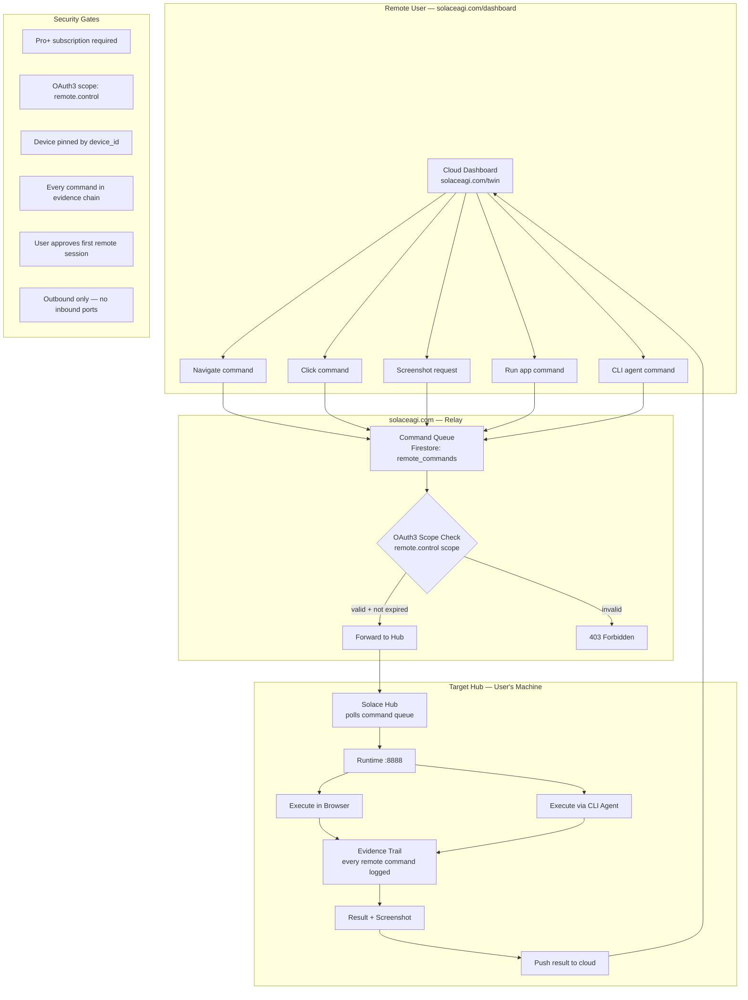

<!-- Diagram: hub-remote-control -->
# hub-remote-control: Hub Remote Control — Control Any Hub from Anywhere
# DNA: `remote = dashboard(cloud) → command(queue) → hub(poll) → execute(browser|cli) → evidence(always)`
# Auth: 65537 | Version: 1.0.0


## Extends
- [STYLES.md](STYLES.md) — base classDef conventions
- [hub-tunnel](hub-tunnel.prime-mermaid.md) — parent diagram

## Canonical Diagram



## PM Status
<!-- Updated: 2026-03-17 | Session: P-71 | GLOW 584-586 -->
<!-- Self-QA verified: all nodes cross-checked against deployed code -->
| Node | Status | Evidence |
|------|--------|----------|
| DASHBOARD | SEALED | /dashboard/remote on solaceagi.com — 4 panels (status, devices, commands, history). GLOW 586. |
| CMD_NAV-CMD_CLI | SEALED | POST /api/v1/remote/command with 7 command types (navigate, click, run, screenshot, execute, restart, status) |
| RELAY | SEALED | Firestore remote_commands collection. POST queues, GET /pending polls, POST /result stores. |
| AUTH | SEALED | Firebase auth + API key on all routes. get_current_user dependency injection. |
| FORWARD | SEALED | hub.py tunnel proxy /proxy/{path} + remote.py pending queue → Hub polls outbound |
| HUB | SEALED | Runtime polls GET /api/v1/remote/pending/{device_id}. WSS tunnel via hub.py /connect. |
| BROWSER | SEALED | POST /api/v1/browser/command/:id → session_channels → WS → sidebar executes |
| CLI_AGENT | SEALED | GET /api/v1/agents/ detects claude/codex/gemini/cursor/aider on PATH |
| EVIDENCE | SEALED | SHA-256 hash-chained evidence on every command (remote.py:_evidence_hash) |
| RESULT | SEALED | POST /api/v1/remote/result/{command_id} → Firestore remote_results + evidence_hash |
| S1 | SEALED | Pro+ subscription check: hub.py:_is_paid_tier() (pro/team/enterprise) |
| S2 | SEALED | Auth on all routes: Firebase JWT + sw_sk_ API keys + session tokens |
| S3 | SEALED | device_id required in commands + device_heartbeats Firestore collection |
| S4 | SEALED | _evidence_hash() SHA-256 canonical string on every command |
| S5 | SEALED | tunnel_consent.py:sign_consent() — FDA Part 11 consent form (GLOW 584) |
| S6 | SEALED | Hub polls outbound. No inbound ports. WSS tunnel outbound-only. |


## Related Papers
- [papers/hub-three-realms-paper.md](../papers/hub-three-realms-paper.md)

## Forbidden States
```
PORT_9222              → KILL
INBOUND_PORTS          → KILL (outbound only)
PLAINTEXT_TOKEN_SYNC   → KILL (AES-256-GCM always)
REVOKE_WITHOUT_SYNC    → KILL (revocation must reach ALL devices)
REMOTE_WITHOUT_EVIDENCE → KILL (every remote command logged)
REMOTE_WITHOUT_APPROVAL → KILL (first session needs user approval)
```

## Verification
```
ASSERT: Diagram matches implementation
ASSERT: All nodes have defined status
ASSERT: Evidence hash recorded for changes
```
