<!-- Diagram: 05-solace-runtime-architecture -->
# 05: Solace Runtime Architecture
# DNA: `runtime(rust) = 38_route_files × 280_handlers × 40_apps × evidence(sha256) × compression(stillwater+ripple)`
# Auth: 65537 | State: GOOD | Version: 3.0.0 | Paper: 56

## Identity
- **Type**: System architecture
- **Covers**: solace-browser/solace-runtime/src/**
- **Port**: 8888 (ONLY — 9222 FORBIDDEN)
- **Binary**: Rust (axum + tokio), 27,710 lines Rust, 132 tests, 77 source files


## Extends
- [STYLES.md](STYLES.md) — base classDef conventions

## Canonical Diagram

```mermaid
flowchart TB
    MAIN[MAIN<br>main.rs] -->|spawn| WS[WEB_SERVER<br>axum :8888]
    MAIN -->|spawn| MCP_SRV[MCP_SERVER<br>stdio JSON-RPC]
    MAIN -->|spawn| CRON_SRV[CRON_SERVICE<br>60s loop]
    MAIN -->|spawn| CLOUD_SRV[CLOUD_SYNC<br>heartbeat 300s]

    subgraph CORE_ROUTES["Core Routes (original)"]
        R_HEALTH[HEALTH<br>/health]
        R_APPS[APPS<br>/api/apps]
        R_SCHED[SCHEDULES<br>/api/schedules]
        R_SESS[SESSIONS<br>/api/v1/browser/sessions]
        R_EVID[EVIDENCE<br>/api/v1/evidence]
        R_NOTIF[NOTIFICATIONS<br>/api/v1/notifications]
        R_DOMAIN[DOMAINS<br>/api/v1/domains]
        R_CLOUD[CLOUD<br>/api/v1/cloud]
        R_SIDE[SIDEBAR<br>/api/v1/sidebar/state]
        R_CHAT[CHAT<br>/api/v1/chat/message]
        R_WIKI[WIKI<br>/api/v1/wiki]
        R_BUDGET[BUDGET<br>/api/v1/budget]
    end

    subgraph NEW_ROUTES["Extended Routes (post v2.1)"]
        R_ACTIONS[ACTIONS<br>actions.rs]
        R_AGENTS[AGENTS<br>agents.rs]
        R_ANALYTICS[ANALYTICS<br>analytics.rs]
        R_APP_CREATE[APP_CREATE<br>app_create.rs]
        R_BACKOFFICE[BACKOFFICE<br>backoffice.rs]
        R_BROWSER_NATIVE[BROWSER_NATIVE<br>browser_native.rs]
        R_CLI_WORKERS[CLI_WORKERS<br>cli_workers.rs]
        R_DELIGHT[DELIGHT<br>delight.rs]
        R_EMAIL[EMAIL<br>email.rs]
        R_ESIGN[ESIGN<br>esign.rs]
        R_EVENTS[EVENTS<br>events.rs]
        R_FILES[FILES<br>files.rs]
        R_FILE_WATCHER[FILE_WATCHER<br>file_watcher.rs]
        R_OAUTH3[OAUTH3<br>oauth3.rs]
        R_PUBSUB[PUBSUB<br>pubsub_api.rs]
        R_QA[QA<br>qa.rs]
        R_RECIPES[RECIPES<br>recipes.rs]
        R_RTC[RTC<br>rtc.rs]
        R_SYNC[SYNC<br>sync.rs]
        R_TUTORIAL[TUTORIAL<br>tutorial.rs]
        R_WEBHOOKS[WEBHOOKS<br>webhooks.rs]
    end

    subgraph WS_ROUTES["WebSocket + Control"]
        WS_DASH[WS_DASHBOARD<br>/ws/dashboard]
        WS_YIN[WS_YINYANG<br>/ws/yinyang]
        R_TUNNEL[TUNNEL<br>tunnel.rs]
        R_HUB_CTRL[HUB_CONTROL<br>hub_control.rs]
        R_BROWSER_CTRL[BROWSER_CTRL<br>browser_control.rs]
    end

    WS --> CORE_ROUTES
    WS --> NEW_ROUTES
    WS --> WS_ROUTES

    R_APPS -->|dispatch| ENGINE[APP_ENGINE<br>runner.rs]
    CRON_SRV -->|dispatch| ENGINE

    subgraph ENGINE_INTERNAL["App Engine"]
        INBOX_READ[INBOX_READ<br>manifest.yaml]
        DATA_FETCH[DATA_FETCH<br>reqwest 30s timeout]
        TEMPLATE[TEMPLATE_RENDER<br>minijinja]
        OUTBOX_WRITE[OUTBOX_WRITE<br>report.html]
        WASM[WASM_SANDBOX<br>wasm_sandbox.rs]
    end
    ENGINE --> ENGINE_INTERNAL

    ENGINE --> EVIDENCE_SEAL[EVIDENCE_SEAL<br>pzip + sha256]
    EVIDENCE_SEAL --> PZIP[PZIP_COMPRESS<br>PZJS/PZJ0/PZWB]
    EVIDENCE_SEAL --> CHAIN[HASH_CHAIN<br>sha256 linked]

    subgraph BACKOFFICE_ENGINE["Backoffice Framework"]
        BO_SCHEMA[SCHEMA<br>schema.rs<br>YAML to DDL]
        BO_DB[DB<br>db.rs<br>SQLite engine]
        BO_CRUD[CRUD<br>crud.rs<br>REST API]
    end
    R_BACKOFFICE --> BACKOFFICE_ENGINE

    subgraph AUTH["Auth Layer"]
        MERKLE[MERKLE<br>auth/merkle.rs]
        AUTH_MOD[AUTH<br>auth/mod.rs]
    end

    CLOUD_SRV -->|paid only| HEARTBEAT[HEARTBEAT_PUSH<br>solaceagi.com]
    CLOUD_SRV -->|paid only| EVID_SYNC[EVIDENCE_SYNC<br>solaceagi.com]

    R_SIDE --> SIDE_GATE{SIDEBAR_GATE<br>4-state auth}
    SIDE_GATE -->|unregistered| FORBIDDEN_NO_AUTH[BLOCKED]
    SIDE_GATE -->|no_llm| FORBIDDEN_NO_LLM[BLOCKED]
    SIDE_GATE -->|byok| CHAT_ENABLED[CHAT_OK]
    SIDE_GATE -->|paid| CHAT_MANAGED[MANAGED_OK]

    STATE[APP_STATE<br>state.rs<br>RwLock] -.->|shared| WS
    PERSIST[PERSISTENCE<br>~/.solace/*.json] -.->|rw| STATE
    CRYPTO[CRYPTO<br>AES-256-GCM] -.->|vault| PERSIST

    classDef forbidden fill:#ffefef,stroke:#cc0000,stroke-width:2px
    classDef gate fill:#fff9c4,stroke:#f9a825,stroke-width:2px
    classDef active fill:#e3f2fd,stroke:#1565c0,stroke-width:2px
    classDef pass fill:#e8f5e9,stroke:#2e7d32,stroke-width:2px
    classDef new fill:#f3e5f5,stroke:#7b1fa2,stroke-width:2px

    class FORBIDDEN_NO_AUTH,FORBIDDEN_NO_LLM forbidden
    class SIDE_GATE gate
    class WS,MCP_SRV,CRON_SRV,CLOUD_SRV,ENGINE active
    class CHAT_ENABLED,CHAT_MANAGED pass
    class R_ACTIONS,R_AGENTS,R_ANALYTICS,R_APP_CREATE,R_BACKOFFICE,R_BROWSER_NATIVE,R_CLI_WORKERS,R_DELIGHT,R_EMAIL,R_ESIGN,R_EVENTS,R_FILES,R_FILE_WATCHER,R_OAUTH3,R_PUBSUB,R_QA,R_RECIPES,R_RTC,R_SYNC,R_TUTORIAL,R_WEBHOOKS new
```



## PM Status
<!-- Updated: 2026-03-29 | Audited by: Antigravity (diagram-vs-code audit) | 38 route files, 280 handlers, 132 tests -->

### Core Services (verified SEALED)
| Node | Status | Evidence |
|------|--------|----------|
| MAIN | SEALED | main.rs spawns web server + MCP + cron + cloud sync |
| WS | SEALED | axum :8888 in server.rs, X-Service-Id middleware |
| MCP_SRV | SEALED | mcp.rs stdio JSON-RPC |
| CRON_SRV | SEALED | cron.rs 60s loop |
| CLOUD_SRV | SEALED | cloud.rs heartbeat 300s + evidence sync |
| STATE | SEALED | state.rs RwLock shared state |
| PERSIST | SEALED | persistence.rs ~/.solace/*.json |
| CRYPTO | SEALED | crypto.rs AES-256-GCM vault |
| AUTO_UPDATE | SEALED | updates.rs GCS hourly check + SHA-256 verify |

### Core Routes (verified SEALED)
| Node | Status | Evidence |
|------|--------|----------|
| R_HEALTH | SEALED | routes/health.rs (5 async fn) |
| R_APPS | SEALED | routes/apps.rs (7 async fn) |
| R_SCHED | SEALED | routes/schedules.rs (6 async fn) |
| R_SESS | SEALED | routes/sessions.rs (6 async fn) |
| R_EVID | SEALED | routes/evidence.rs (5 async fn) |
| R_NOTIF | SEALED | routes/notifications.rs (4 async fn) |
| R_DOMAIN | SEALED | routes/domains.rs (11 async fn) |
| R_CLOUD | SEALED | routes/cloud.rs (6 async fn) |
| R_SIDE | SEALED | routes/sidebar.rs (5 async fn) |
| R_CHAT | SEALED | routes/chat.rs (7 async fn) |
| R_WIKI | SEALED | routes/wiki.rs (8 async fn) |
| R_BUDGET | SEALED | routes/budget.rs (3 async fn) |
| R_TUNNEL | SEALED | routes/tunnel.rs (6 async fn) |
| R_HUB_CTRL | SEALED | routes/hub_control.rs (12 async fn) |
| R_BROWSER_CTRL | SEALED | routes/browser_control.rs (8 async fn) |
| WS_DASH | SEALED | routes/websocket.rs /ws/dashboard |
| WS_YIN | SEALED | routes/websocket.rs /ws/yinyang |

### Extended Routes (post v2.1 — newly tracked)
| Node | Status | Evidence |
|------|--------|----------|
| R_ACTIONS | SEALED | routes/actions.rs (3 async fn) |
| R_AGENTS | SEALED | routes/agents.rs (3 async fn) — agent registry |
| R_ANALYTICS | SEALED | routes/analytics.rs (3 async fn) |
| R_APP_CREATE | SEALED | routes/app_create.rs (5 async fn) — dynamic app creation |
| R_BACKOFFICE | SEALED | routes/backoffice.rs (11 async fn) — config-driven CRUD |
| R_BROWSER_NATIVE | SEALED | routes/browser_native.rs (25 async fn) — C++ native bridge |
| R_CLI_WORKERS | SEALED | routes/cli_workers.rs (3 async fn) — external agent jobs |
| R_DELIGHT | SEALED | routes/delight.rs (2 async fn) — warm token responses |
| R_EMAIL | SEALED | routes/email.rs (1 async fn) |
| R_ESIGN | SEALED | routes/esign.rs (10 async fn) — FDA Part 11 e-signatures |
| R_EVENTS | SEALED | routes/events.rs (2 async fn) — runtime event stream |
| R_FILES | SEALED | routes/files.rs (24 async fn) — file read/write/watch |
| R_FILE_WATCHER | SEALED | routes/file_watcher.rs (3 async fn) — FSEvent streaming |
| R_OAUTH3 | SEALED | routes/oauth3.rs (4 async fn) — OAuth3 token management |
| R_PUBSUB | SEALED | routes/pubsub_api.rs (12 async fn) — pub/sub messaging |
| R_QA | SEALED | routes/qa.rs (13 async fn) — QA tree + evidence viewer |
| R_RECIPES | SEALED | routes/recipes.rs (5 async fn) — recipe CRUD + execute |
| R_RTC | SEALED | routes/rtc.rs (4 async fn) — real-time communication |
| R_SYNC | SEALED | routes/sync.rs (5 async fn) — cloud sync operations |
| R_TUTORIAL | SEALED | routes/tutorial.rs (4 async fn) — onboarding tutorial |
| R_WEBHOOKS | SEALED | routes/webhooks.rs (4 async fn) — external webhook intake |

### App Engine (verified SEALED)
| Node | Status | Evidence |
|------|--------|----------|
| ENGINE | SEALED | app_engine/runner.rs — orchestrates inbox→fetch→template→outbox |
| INBOX_READ | SEALED | app_engine/inbox.rs — reads manifest.yaml |
| DATA_FETCH | SEALED | app_engine/runner.rs — reqwest 30s timeout |
| TEMPLATE | SEALED | app_engine/template.rs — minijinja rendering |
| OUTBOX_WRITE | SEALED | app_engine/outbox.rs — writes report.html |
| WASM | SEALED | app_engine/wasm_sandbox.rs — WASM execution sandbox |
| LLM_ROUTING | SEALED | app_engine/runner.rs — L1-L5 routing via OpenRouter |
| CONDUCTOR | SEALED | app_engine/runner.rs — conductor apps read orchestrated outboxes |

### Backoffice Framework (verified SEALED)
| Node | Status | Evidence |
|------|--------|----------|
| BO_SCHEMA | SEALED | backoffice/schema.rs — YAML manifest → SQLite DDL generator |
| BO_DB | SEALED | backoffice/db.rs — SQLite engine + migration |
| BO_CRUD | SEALED | backoffice/crud.rs — REST CRUD + FTS + audit trail |

### Evidence + Compression (verified SEALED)
| Node | Status | Evidence |
|------|--------|----------|
| EVIDENCE_SEAL | SEALED | pzip/evidence.rs SHA-256 + PZip sealing |
| PZIP | SEALED | pzip/web.rs + pzip/json.rs + pzip/jsonl.rs codecs |
| CHAIN | SEALED | pzip/evidence.rs hash chain linking |
| STILLWATER | SEALED | pzip/stillwater.rs — cross-file compression base |

### Auth (verified SEALED)
| Node | Status | Evidence |
|------|--------|----------|
| MERKLE | SEALED | auth/merkle.rs — Merkle tree verification |
| AUTH_MOD | SEALED | auth/mod.rs — auth middleware |
| SIDE_GATE | SEALED | routes/sidebar.rs 4-state gate |

## Related Papers
- [papers/hub-service-mesh-paper.md](../papers/hub-service-mesh-paper.md)
- [papers/hub-three-realms-paper.md](../papers/hub-three-realms-paper.md)
- [papers/hub-runtime-os-paper.md](../papers/hub-runtime-os-paper.md) — Paper 56: The OS for AI Agents

## Forbidden States
```
PORT_9222_ANYWHERE        → KILL (port 8888 ONLY)
PYTHON_SERVER             → BLOCKED (Rust solace-runtime replaces Rust runtime (solace-runtime))
CLOUD_SYNC_FREE_USER      → BLOCKED (paid_user=false → zero cloud calls)
CHAT_WITHOUT_LLM          → BLOCKED (sidebar gate enforces BYOK or paid)
EVIDENCE_WITHOUT_SEAL     → BLOCKED (PZip + SHA-256 before write)
ENGINE_WITHOUT_MANIFEST   → BLOCKED (no manifest.yaml → no execution)
FETCH_WITHOUT_TIMEOUT     → BLOCKED (all HTTP fetches have 30s timeout)
EXTENSION_API             → KILL (native C++ WebUI, NOT Chrome extension)
```

## Covered Files
```
code (77 source files):
  - solace-browser/solace-runtime/src/main.rs
  - solace-browser/solace-runtime/src/server.rs
  - solace-browser/solace-runtime/src/state.rs
  - solace-browser/solace-runtime/src/lib.rs
  - solace-browser/solace-runtime/src/config.rs
  - solace-browser/solace-runtime/src/utils.rs
  - solace-browser/solace-runtime/src/routes/*.rs (38 files)
  - solace-browser/solace-runtime/src/app_engine/*.rs (6 files)
  - solace-browser/solace-runtime/src/backoffice/*.rs (4 files)
  - solace-browser/solace-runtime/src/pzip/*.rs (8 files)
  - solace-browser/solace-runtime/src/auth/*.rs (2 files)
  - solace-browser/solace-runtime/src/{cron,cloud,mcp,crypto,persistence,evidence,event_log,pubsub,job_queue,recipe,agents,updates}.rs
specs:
  - specs/core/08-runtime.md
  - specs/core/09-agent-friendly.md
  - specs/core/38-diagram-map-architecture.md
tests:
  - solace-browser/solace-runtime/tests/integration.rs
  - inline #[test] modules across src/ (132 total tests)
services:
  - localhost:8888/* (280 async handlers)
```

## Verification Assertions
```
ASSERT: cargo check exits 0
ASSERT: cargo test exits 0 with ≥132 tests passing
ASSERT: curl localhost:8888/health returns {"ok": true}
ASSERT: curl localhost:8888/api/apps returns JSON array
ASSERT: find src/routes -name '*.rs' | wc -l == 38
ASSERT: grep -rc 'async fn' src/ | awk -F: '{s+=$2}END{print s}' >= 280
ASSERT: grep -rc '#[test]' src/ tests/ | awk -F: '{s+=$2}END{print s}' >= 132
ASSERT: wc -l src/**/*.rs >= 27000
ASSERT: ls data/apps/ | wc -l >= 40
```
