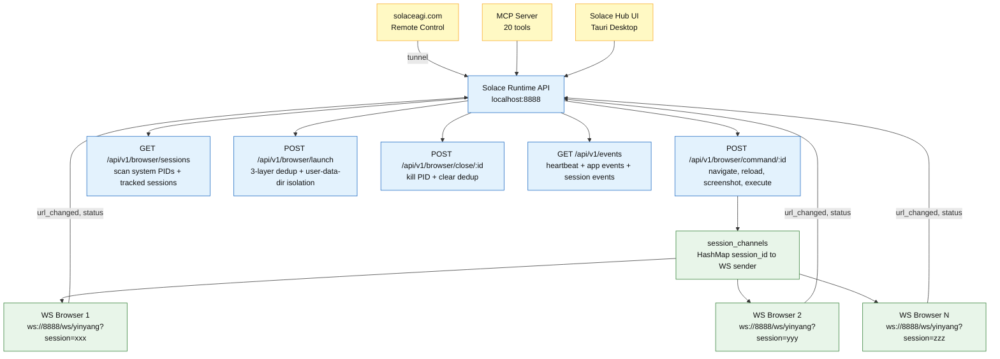

<!-- Diagram: hub-session-control -->
# Hub Session Control -- WebSocket Command Channel
# SHA-256: pending
## DNA: `control = hub(api) → runtime(ws_channel) → browser(sidebar_js) × bidirectional × cross_platform`
# Auth: 65537 | State: GOOD | Version: 1.0.0

## Canonical Diagram



## Commands (Hub → Browser via WS)

| Command | Payload | Description |
|---------|---------|-------------|
| navigate | `{"command":"navigate","url":"..."}` | Go to URL |
| reload | `{"command":"reload"}` | Reload current page |
| get_url | `{"command":"get_url"}` | Request current URL |
| screenshot | `{"command":"screenshot"}` | Capture page screenshot |
| execute | `{"command":"execute","code":"..."}` | Run JS in page |

## Messages (Browser → Hub via WS)

| Type | Payload | Description |
|------|---------|-------------|
| url_changed | `{"type":"url_changed","url":"..."}` | Browser navigated |
| status | `{"type":"status","url":"...","title":"..."}` | Current state |
| screenshot | `{"type":"screenshot","data":"base64..."}` | Screenshot result |

## Session Modes (GLOW 563)

| Mode | Behavior |
|------|----------|
| Single (default) | 1 browser per session. Kill all before new launch. |
| Multiple (advanced) | Table with New/Close per session, separate user-data-dir |

## Domain Tab Coordination (GLOW 564)

| Rule | Behavior |
|------|----------|
| 1 tab per domain | Apps in the same domain share a browser tab |
| Acquire/Release | App calls POST /domains/:d/tab → works → POST /domains/:d/tab/release |
| Conflict | Second app gets 409 if domain tab is busy |
| Subdomain | Default: subdomains share root domain. Large platforms (Google): separate |

See: `specs/hub/diagrams/hub-domain-tab-coordination.prime-mermaid.md`

## PM Status
<!-- Updated: 2026-03-17 | Session: P-71 | GLOW 586 -->
| Node | Status | Evidence |
|------|--------|----------|
| HUB_API | SEALED | Runtime serves 80+ endpoints on :8888 including tunnel (GLOW 585-586) |
| CMD (command endpoint) | SEALED | POST /api/v1/browser/command/:id + tunnel relay implemented |
| CHANNEL (session_channels) | SEALED | HashMap in AppState + domain_tab_changed WS notifications |
| WS (yinyang WebSocket) | SEALED | ws://8888/ws/yinyang?session=xxx, bidirectional + domain_tab_changed notifications |
| SESSIONS (scan PIDs) | SEALED | scans system for main solace processes, session_channels HashMap |
| LAUNCH (single mode) | SEALED | Default single browser + 3-layer dedup |
| CLOSE (kill) | SEALED | kills PID + clears dedup + close-all endpoint |
| DOMAIN_TABS | SEALED | 1 tab per domain, acquire/release/conflict + subdomain extraction + cooldown timer |
| DASHBOARD | SEALED | GET /dashboard — full status page with sb-* styleguide |
| EVENTS (heartbeat) | SEALED | 60s heartbeat + app outbox events + domain tab WS notifications |
| CLOUD (remote) | SEALED | WSS tunnel client + consent + auto-disconnect + evidence + remote dashboard (GLOW 585-586) |

## Covered Files
```
code:
  - solace-browser/solace-runtime/src/routes/sessions.rs (single browser + dedup)
  - solace-browser/solace-runtime/src/routes/domains.rs (domain tab coordination)
  - solace-browser/solace-runtime/src/routes/files.rs (dashboard page)
  - solace-browser/solace-runtime/src/routes/websocket.rs
  - solace-browser/solace-runtime/src/state.rs (session_channels + domain_tabs)
  - solace-browser/solace-hub/src/index.html (Hub UI)
specs:
  - specs/hub/diagrams/hub-session-control.prime-mermaid.md
  - specs/hub/diagrams/hub-domain-tab-coordination.prime-mermaid.md
```

## Forbidden States
```
COMMAND_WITHOUT_SESSION      → KILL (session_id required — no broadcast to all browsers)
WS_ON_PORT_9222             → KILL (port 9222 BANNED — WebSocket on :8888 only)
ORPHAN_SESSION_NO_CLEANUP   → KILL (dead PID must clear session_channels entry)
LAUNCH_DUPLICATE_SESSION     → KILL (3-layer dedup prevents duplicate browser launch)
XDOTOOL_BROWSER_CONTROL     → KILL (all control via WebSocket commands — xdotool BANNED)
```

## Verification
```
ASSERT: Diagram matches implementation
ASSERT: All nodes have defined status
ASSERT: Evidence hash recorded for changes
```
