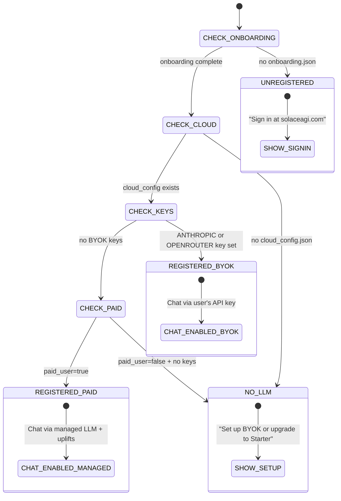

<!-- Diagram: 08-sidebar-auth-gate -->
# 08: Sidebar Auth Gate — 4-State Machine
# SHA-256: 06be6ff28d11f9aa8814277f434c7dd1b3d2dbae23699c0a0dd9bfda75b0d8ea
# DNA: `sidebar = unregistered | no_llm | byok(user_key) | paid(managed_llm); !auth → chat_disabled`
# Auth: 65537 | State: SEALED | Version: 1.0.0


## Extends
- [STYLES.md](STYLES.md) — base classDef conventions
- [hub-runtime](hub-runtime.prime-mermaid.md) — parent diagram

## Canonical Diagram



## PM Status
<!-- Updated: 2026-03-15 | Session: P-68 | Self-QA verified P-68 via localhost:8888 endpoints -->
| Node | Status | Evidence |
|------|--------|----------|
| CHECK_ONBOARDING | SEALED | Rust compute_sidebar_state() checks onboarding.json; verified via /api/v1/sidebar/state |
| UNREGISTERED | SEALED | Rust returns gate="unregistered"; verified via localhost:8888 |
| CHECK_CLOUD | SEALED | Rust checks cloud_config.json; verified via /api/v1/sidebar/state |
| NO_LLM | SEALED | Rust sidebar.rs returns no_llm state; verified via localhost:8888 |
| CHECK_KEYS | SEALED | Rust has_byok_key() checks byok.json + env; verified via /api/v1/sidebar/state |
| REGISTERED_BYOK | SEALED | Rust sidebar.rs BYOK path; verified via localhost:8888 |
| CHECK_PAID | SEALED | Rust sidebar.rs checks paid_user flag; verified via /api/v1/sidebar/state |
| REGISTERED_PAID | SEALED | Rust sidebar.rs paid state; returns gate="paid", chat_enabled=true |
| SHOW_SIGNIN | SEALED | Sidebar displays sign-in message; verified via localhost:8888 |
| SHOW_SETUP | SEALED | Sidebar displays BYOK setup message; verified via localhost:8888 |
| CHAT_ENABLED_BYOK | SEALED | Rust chat.rs via user API key; verified via localhost:8888 |
| CHAT_ENABLED_MANAGED | SEALED | Rust chat.rs managed LLM; verified via localhost:8888 |


## Related Papers
- [papers/hub-sidebar-paper.md](../papers/hub-sidebar-paper.md)

## Forbidden States
```
CHAT_WITHOUT_AUTH       -> 403 (sidebar gate blocks)
CHAT_WITHOUT_LLM       -> 403 (need BYOK or paid)
MANAGED_LLM_FREE_USER  -> BLOCKED (managed uplifts = paid only)
API_KEY_IN_BROWSER      -> KILL (memory only, never localStorage)
```

## Covered Files
```
code:
  - solace-browser/solace-runtime/src/routes/sidebar.rs
  - solace-browser/solace-runtime/src/routes/chat.rs
  - src/browser/solace_browser_server.py (_get_sidebar_state, _handle_chat_message)
services:
  - localhost:8888/api/v1/sidebar/state
  - localhost:8888/api/v1/chat/message
  - localhost:8888/ws/yinyang
```

## Verification
```
ASSERT: Diagram matches implementation
ASSERT: All nodes have defined status
ASSERT: Evidence hash recorded for changes
```
