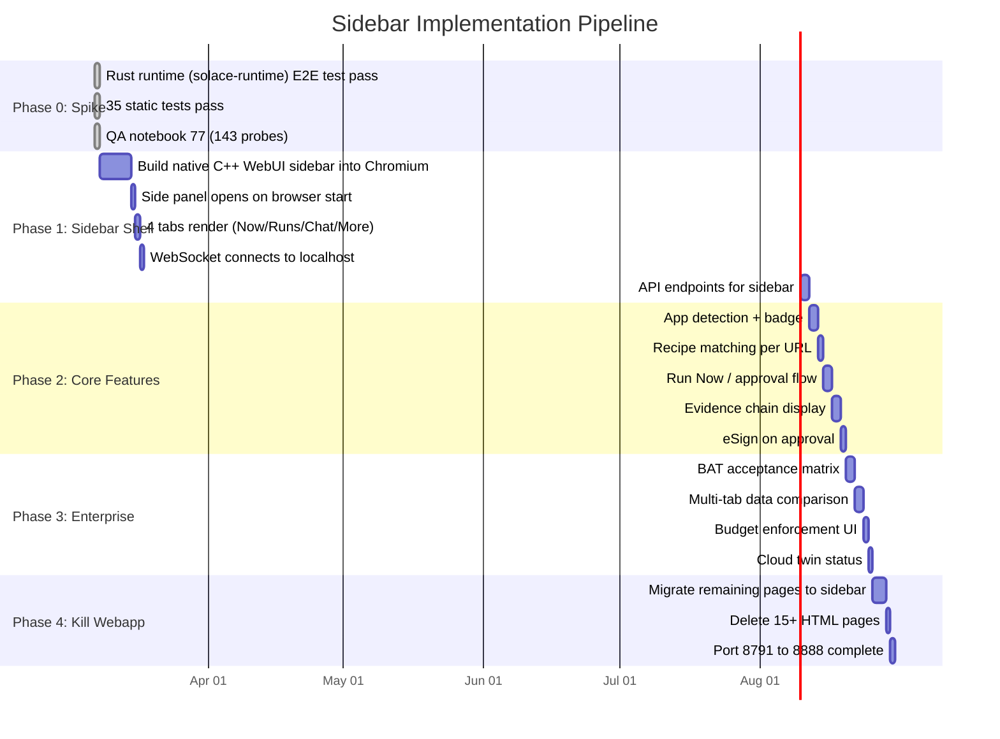

<!-- Diagram: 10-sidebar-implementation-phases -->
# 10: Diagram 29: Sidebar Implementation Phases
# DNA: `phases = P0(tests) → P1(shell) → P2(features) → P3(enterprise) → P4(kill webapp)`
# SHA-256: cb20a8c254261cf250adde71d461c947f2be58dec1acd47b9c0fa3d4cbe1fe87
# Auth: 65537 | State: SEALED | Version: 1.0.0


## Extends
- [STYLES.md](STYLES.md) — base classDef conventions

## Canonical Diagram



## PM Status
<!-- Updated: 2026-03-14 | Session: P-67 -->
No flowchart nodes — Gantt chart covers implementation phases.
Overall: N/A


## Related Papers
- [papers/hub-sidebar-paper.md](../papers/hub-sidebar-paper.md)

## Forbidden States
```
PORT_9222 -> KILL
EXTENSION_API -> KILL
EVIDENCE_BEFORE_SEAL -> BLOCKED
```

## Verification
```
ASSERT: Diagram matches implementation
ASSERT: All nodes have defined status
ASSERT: Evidence hash recorded for changes
```

## LEAK Interactions
- Calls: backoffice-messages, evidence chain
- Orchestrates with: other Solace apps via API
- Pattern: input → process → output → evidence
