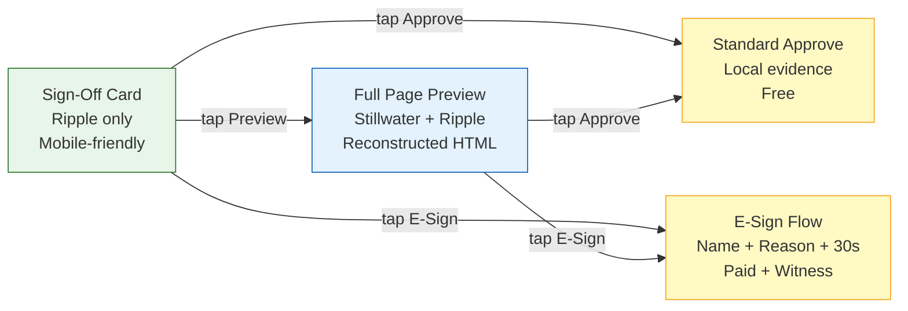

<!-- Diagram: hub-signoff-ui -->
# Hub Sign-Off UI — Universal Approval Card for All Action Types
## DNA: `signoff_card = ripple(action_data) × stillwater(approval_template) → approve|reject|esign`
## Auth: 65537 | State: SEALED | Version: 1.0.0
## Committee: Ive (design) · Norman (UX) · Kelman (FDA) · Dragon Rider

### Einstein: The Approval Conveyor Belt
> Items arrive on a conveyor belt — emails, posts, exports, transfers.
> The inspector has ONE desk. ONE form. ONE process.
> WHAT is it? WHO requested? WHY approve? → APPROVE or REJECT.
> The items look different but the approval is identical.

### The Universal Sign-Off Card

Every approval looks the same regardless of action type:

```
┌─────────────────────────────────────────┐
│ ● L3 Compose                    30s ⏱   │  ← Level pill + cooldown
│─────────────────────────────────────────│
│ 📧 gmail-inbox-triage                    │  ← App name + icon
│ mail.google.com                          │  ← Domain
│─────────────────────────────────────────│
│ "Reply to Sarah about Q3 budget..."      │  ← Action summary (1-2 lines)
│                                          │
│ To: sarah@company.com                    │  ← Key details (varies by type)
│ Subject: Re: Q3 Budget Review            │
│ Body preview: "Thanks for sending..."    │
│─────────────────────────────────────────│
│ [Preview Full Page]    [View Evidence]   │  ← Optional expand
│─────────────────────────────────────────│
│  [ ✓ Approve ]          [ ✗ Reject ]    │  ← Standard mode
│  [ 🔏 E-Sign (paid) ]                   │  ← E-sign mode (Pro+)
└─────────────────────────────────────────┘
```

### Same Card, Different Content

| Action Type | App | Key Details Shown |
|-------------|-----|-------------------|
| Email draft | gmail-inbox-triage | To, Subject, Body preview |
| Social post | twitter-poster | Platform, Content, Hashtags, Schedule |
| LinkedIn msg | linkedin-outreach | Recipient, Message preview, Connection note |
| Data export | data-exporter | Format, Row count, Destination |
| App run | morning-brief | Sources, Schedule, Output format |
| Price alert | amazon-price-tracker | Product, Current price, Target, Action |
| Code PR | github-issue-triage | Repo, Branch, Files changed, CI status |
| Transfer | payment-app | Amount, Recipient, Reference |

### Two Preview Modes



**Easy mode (Ripple card):**
- Renders from Ripple JSON (the action-specific data)
- ~500 bytes of data → instant render
- Mobile-friendly: fits on phone screen
- 3 taps: open → read → approve

**Full preview (Stillwater + Ripple):**
- Reconstructs full HTML page from PZip
- Looks exactly like the original domain page
- Desktop review for high-stakes actions
- No images stored — HTML renders images from URLs

### Implementation: Approval Queue Endpoint

```
GET /api/v1/approvals/pending
→ Returns array of sign-off cards:

[
  {
    "id": "uuid",
    "level": "L3",
    "level_label": "Compose",
    "app_id": "gmail-inbox-triage",
    "app_name": "Gmail Inbox Triage",
    "domain": "mail.google.com",
    "action": "reply_to_email",
    "summary": "Reply to Sarah about Q3 budget review",
    "details": {
      "to": "sarah@company.com",
      "subject": "Re: Q3 Budget Review",
      "body_preview": "Thanks for sending the Q3 numbers..."
    },
    "cooldown_seconds": 30,
    "created_at": "2026-03-18T20:00:00Z",
    "expires_at": "2026-03-18T20:05:00Z",
    "preview_url": "/api/v1/approvals/{id}/preview",
    "esign_available": true
  }
]
```

### No Images — Ever

> "The best image is the one you don't store." — Jony Ive

PZip Stillwater + Ripple can reconstruct any page:
- Email: HTML template + Ripple (to, subject, body) = full email preview
- Social post: HTML template + Ripple (content, hashtags) = full post preview
- Dashboard: HTML template + Ripple (data) = full dashboard

Images in the original page load from URLs at render time.
We store ZERO images. We store structure (Stillwater) + data (Ripple).
Total storage per approval: ~2KB (not 200KB with screenshots).

### PM Status
<!-- Updated: 2026-03-18 | Session: P-71 | GLOW 612 -->
| Node | Status | Evidence |
|------|--------|----------|
| CARD_DESIGN | SEALED | Universal card layout: level + app + domain + summary + details + actions |
| EASY_MODE | SEALED | Ripple-only card, mobile-friendly, 3 taps |
| FULL_PREVIEW | SEALED | Stillwater + Ripple reconstructed HTML |
| STANDARD_APPROVE | SEALED | POST /api/v1/esign/sign (local evidence) |
| ESIGN_APPROVE | SEALED | POST /api/v1/esign/package (paid, witnessed) |
| ACTION_TYPES | SEALED | Email, social, LinkedIn, export, app run, price, code, transfer |
| NO_IMAGES | SEALED | PZip reconstruction, zero image storage |
| MOBILE_FRIENDLY | SEALED | Card fits phone screen, responsive |

## Forbidden States
```
APPROVAL_WITHOUT_CARD        → KILL (every approval must render the standard card)
CARD_WITHOUT_LEVEL           → KILL (level pill always visible)
CARD_WITHOUT_DOMAIN          → KILL (domain always shown)
ESIGN_ON_FREE                → BLOCKED (e-sign is paid feature)
IMAGE_STORED                 → KILL (reconstruct from PZip, never store images)
APPROVAL_AFTER_EXPIRY        → KILL (expired approvals auto-reject)
```

## Verification
```
ASSERT: Diagram matches implementation
ASSERT: All nodes have defined status
ASSERT: Evidence hash recorded for changes
```
