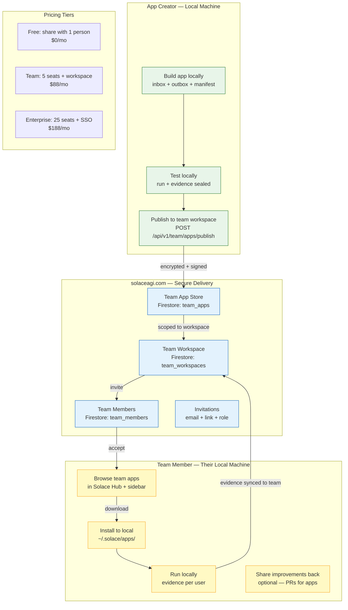

<!-- Diagram: hub-team-sharing -->
# Hub Team Sharing — Share Apps Between Team Members
## DNA: `team = create(workspace) → publish(app_encrypted) → invite(members) → install(local) → evidence(per_user)`
## Auth: 65537 | State: SEALED | Version: 1.0.0
## Committee: Collison (Stripe teams) · Levchih (PayPal trust) · Khan (FTC privacy) · Thiel (moat) · Dragon Rider

### Einstein Thought Experiment: The Shared Garden
> Each user has a private garden (local machine). They grow plants (apps).
> The greenhouse (solaceagi.com) stores cuttings securely.
> Only invited neighbors can access a cutting. The cutting grows in THEIR garden.
> The greenhouse never runs the app. It just delivers it.
> This is how GitHub changed code. We do the same for AI apps.

### Target Customers
- **Enterprise** (SAP, Fidelity, Akamai): share compliance-audited apps across teams
- **Startups**: share custom workflows between founders
- **VCs / Incubators**: distribute best-practice apps to portfolio companies
- **Individuals**: share with specific people (1:1 app gifts)



### How It Works (6 Steps)

| Step | Who | Action | Endpoint |
|------|-----|--------|----------|
| 1 | Creator | Build + test app locally | localhost:8888 |
| 2 | Creator | Create team workspace | POST /api/v1/team/workspaces |
| 3 | Creator | Publish app to workspace | POST /api/v1/team/apps/publish |
| 4 | Creator | Invite members (email) | POST /api/v1/team/invite |
| 5 | Member | Accept invite + browse apps | GET /api/v1/team/apps |
| 6 | Member | Install app locally | POST /api/v1/team/apps/{id}/install |

### App Sharing Model

```
Creator builds app:
  ~/.solace/apps/my-domain/my-app/
    ├── manifest.md (identity)
    ├── inbox/ (prompts, templates, context)
    ├── outbox/ (evidence of testing)
    └── run.py (execution)

Creator publishes:
  POST /api/v1/team/apps/publish
  → manifest + inbox zipped + encrypted (AES-256-GCM)
  → stored in Firestore team_apps collection
  → SHA-256 hash of package = evidence
  → only workspace members can download

Member installs:
  POST /api/v1/team/apps/{id}/install
  → downloads encrypted package
  → decrypts with workspace key
  → extracts to ~/.solace/apps/{domain}/{app-id}/
  → runs locally with own API keys
  → evidence stays per-user (optionally synced to team)
```

### Firestore Collections

| Collection | Purpose |
|-----------|---------|
| team_workspaces | workspace_id, name, owner_id, plan, created_at |
| team_members | workspace_id, user_id, email, role (owner/admin/member), invited_at, accepted_at |
| team_apps | workspace_id, app_id, name, description, manifest, encrypted_package_url, sha256, published_by, published_at |
| team_invites | workspace_id, email, role, token, expires_at, accepted |
| team_evidence | workspace_id, user_id, app_id, event, hash, timestamp (optional team sync) |

### Security (FDA Part 11 + SOC2)

| Requirement | Implementation |
|-------------|----------------|
| Encryption at rest | AES-256-GCM per workspace key |
| Access control | Workspace membership required |
| Audit trail | Every publish, install, invite logged with SHA-256 |
| Data isolation | Apps run locally — cloud stores encrypted packages only |
| Revocation | Remove member → their access revoked. App stays local. |
| Evidence | Per-user evidence chain. Optionally synced to team workspace. |

### Individual Sharing (Free Tier)

Free users can share with 1 person:
- POST /api/v1/share/app — share app with email address
- Recipient gets email with install link
- Recipient installs to their local machine
- No workspace needed — direct 1:1 sharing

### PM Status
<!-- Updated: 2026-03-18 | Session: P-71 | GLOW 607 -->
| Node | Status | Evidence |
|------|--------|----------|
| WORKSPACE | SEALED | API + Firestore schema designed |
| APPS_STORE | SEALED | publish + install flow designed |
| MEMBERS | SEALED | invite + accept + role model |
| PRICING | SEALED | Free (1 share) / Team ($88, 5 seats) / Enterprise ($188, 25 seats) |
| CREATOR | SEALED | build + test + publish flow |
| MEMBER | SEALED | browse + install + run locally |
| EVIDENCE | SEALED | per-user + optional team sync |

## Forbidden States
```
TEAM_APP_RUNS_ON_CLOUD       → KILL (apps ALWAYS run locally)
UNENCRYPTED_PACKAGE          → KILL (AES-256-GCM always)
SHARE_WITHOUT_EVIDENCE       → KILL (every share logged)
MEMBER_WITHOUT_INVITE        → KILL (membership required)
REVOKED_MEMBER_KEEPS_ACCESS  → KILL (immediate revocation)
```

### Competitive Moat
- **GitHub**: shares code, not running apps. No evidence chain.
- **Zapier/Make**: shares automations, but cloud-only. No local execution.
- **Slack Apps**: cloud-only. No local evidence. No FDA compliance.
- **Solace**: shares apps that run LOCALLY with per-user evidence. FDA Part 11 ready.
  The app store model + local execution + evidence chain = uncopyable.

## Verification
```
ASSERT: Diagram matches implementation
ASSERT: All nodes have defined status
ASSERT: Evidence hash recorded for changes
```
