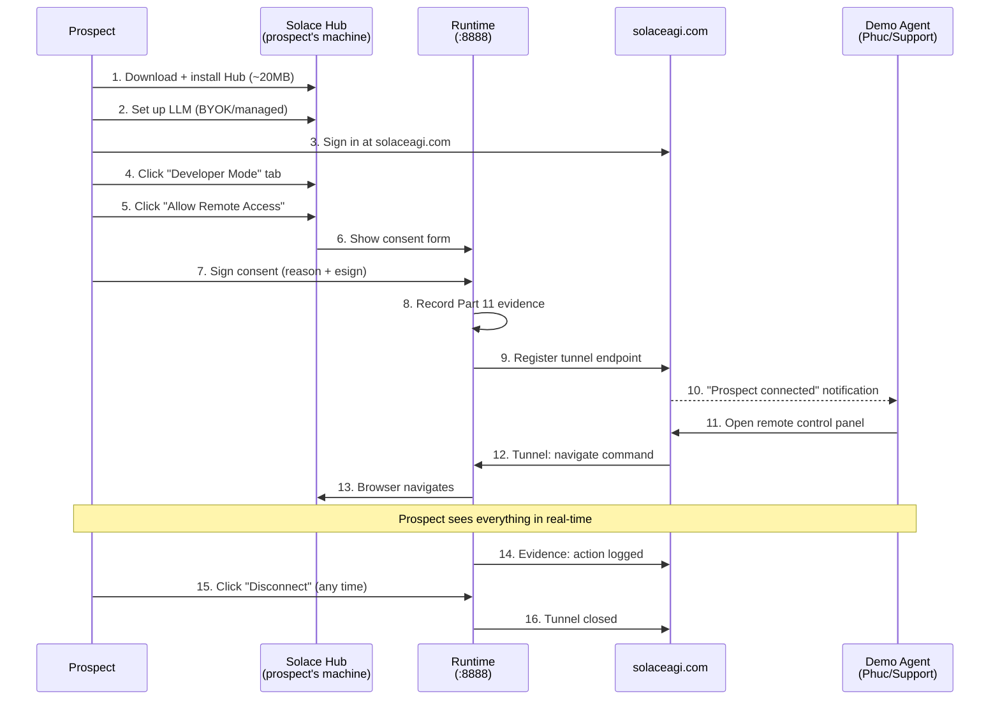
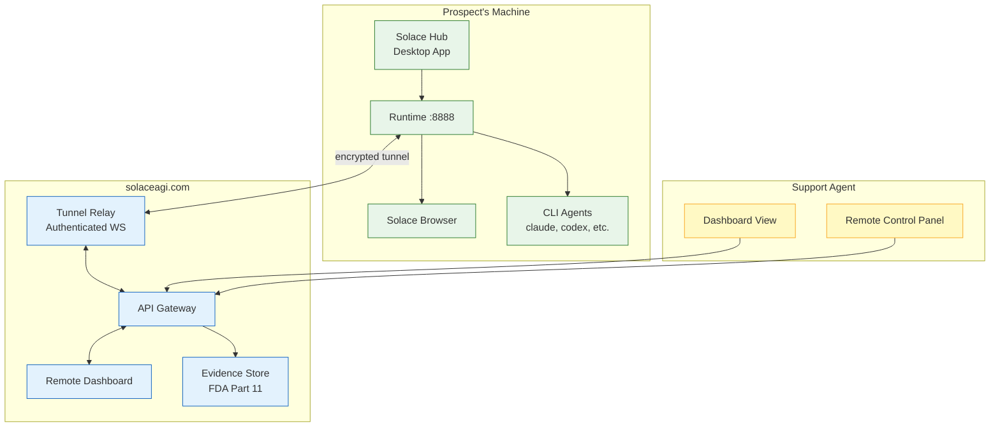

<!-- Diagram: hub-tunnel-remote-control -->
# Hub Tunnel + Remote Control — The Wow Demo
## DNA: `tunnel = consent(fda_sign) → connect(ws_encrypted) → control(browser+cli) → audit(evidence_chain)`
## Auth: 65537 | Paper 55 | Committee: Vogels · Gregg · Hightower · FDA-Kelman · OWASP-Williams

### Einstein Thought Experiment: The Glass House
> Imagine the user's machine is a glass house. They have full control.
> When they allow remote access, they open the front door and hand you a key.
> But the key has a camera on it — every room you enter, every thing you touch
> is recorded. The user can see you through the glass walls in real-time.
> They can revoke the key at any moment. The camera never stops.
> This is FDA Part 11 compliant remote access.

### The Wow Demo Flow


### Architecture


### FDA Part 11 Compliance Matrix

| Requirement | Implementation |
|-------------|----------------|
| Electronic Records | All actions stored as SHA-256 hash-chained evidence |
| Electronic Signatures | User signs consent with reason + timestamp + user_id |
| Audit Trail | Every remote action logged: who, what, when, why, hash |
| Access Control | Tunnel requires explicit consent + authentication |
| Data Integrity | Hash chains detect tampering |
| Record Retention | Configurable: 90 days (Pro) to unlimited (Enterprise) |
| System Validation | Automated QA via Inspector (Paper 44) |

### Security Standards Compliance

| Standard | How |
|----------|-----|
| FDA 21 CFR Part 11 | esign + evidence chain + audit trail |
| SOC2 Type II | access logging + TLS 1.3 in transit |
| OWASP Top 10 | input validation, auth on every endpoint, no injection |
| Zero Trust | every tunnel request re-authenticated, session tokens expire |
| GDPR | data stays on user's machine, tunnel = control only |
| HIPAA (if needed) | evidence retention + access controls + encryption at rest |

### Consent Form Fields
```json
{
  "action": "allow_remote_access",
  "user_id": "user@email.com",
  "reason": "Customer support demo",
  "reason_options": ["support", "demo", "troubleshooting", "training", "custom"],
  "scope": ["browser_control", "cli_dispatch", "evidence_read"],
  "duration_minutes": 30,
  "auto_disconnect": true,
  "timestamp": "2026-03-16T16:30:00Z",
  "signature_hash": "sha256:...",
  "ip_address": "1.2.3.4"
}
```

### API Endpoints (Future)
| Method | Path | Purpose |
|--------|------|---------|
| POST | /api/v1/tunnel/consent | Sign consent form (FDA esign) |
| POST | /api/v1/tunnel/connect | Establish tunnel to solaceagi.com |
| POST | /api/v1/tunnel/disconnect | Close tunnel (user or timeout) |
| GET | /api/v1/tunnel/status | Current tunnel state |
| GET | /api/v1/tunnel/audit | Remote access audit log |

### PM Status
<!-- Updated: 2026-03-17 | Session: P-71 | GLOW 584-586 -->
| Node | Status | Evidence |
|------|--------|----------|
| Consent Form | SEALED | HTML form at GET /api/v1/tunnel/consent + POST sign endpoint. Runtime + Cloud. |
| Tunnel Client | SEALED | Rust tokio-tungstenite WSS client → solaceagi.com/api/v1/hub/connect |
| Remote Dashboard | SEALED | /dashboard/remote on solaceagi.com — 4 panels (status, devices, commands, history). GLOW 586. |
| Evidence Integration | SEALED | Every tunnel action (consent, connect, command, disconnect) hash-chained |
| FDA Part 11 | SEALED | Consent form + evidence chain + audit trail + auto-disconnect |
| Auto-disconnect | SEALED | tokio::spawn timer expires consent after duration_minutes |
| Real-time view | SEALED | Commands relayed via WSS, evidence recorded. Dashboard auto-refreshes every 10s. |
| Cloud Consent API | SEALED | 5 endpoints on solaceagi.com (sign, active, revoke, audit, history) 19/19 tests |
| Local Audit | SEALED | GET /api/v1/tunnel/audit filters evidence.jsonl for tunnel.* events |

### Why This Is Uncopyable
1. **TeamViewer**: Screen sharing only. No browser control. No audit trail.
2. **Tuple/Loom**: Pair programming. No browser automation. No evidence.
3. **Chrome Remote Desktop**: Screen mirroring. No domain-aware tabs. No FDA compliance.
4. **Solace**: Domain-aware browser + CLI + evidence + FDA Part 11 + 1 tab per domain = unique.

## Forbidden States
```
TUNNEL_WITHOUT_CONSENT      → KILL (FDA Part 11 consent form required before any remote access)
UNENCRYPTED_TUNNEL          → KILL (WSS only — plaintext WS forbidden)
COMMAND_WITHOUT_EVIDENCE    → KILL (every remote command hash-chained in audit trail)
CONSENT_AFTER_EXPIRY        → KILL (expired consent auto-disconnects — no grace period)
REMOTE_BYPASSES_BUDGET      → KILL (remote commands still check budget limits)
```

## Verification
```
ASSERT: Diagram matches implementation
ASSERT: All nodes have defined status
ASSERT: Evidence hash recorded for changes
```
