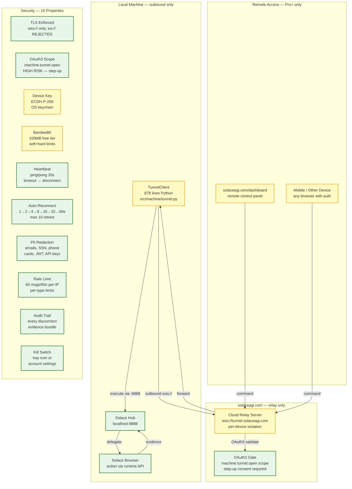

<!-- Diagram: hub-tunnel -->
# hub-tunnel: Custom Reverse Tunnel — 100% In-House (NO Cloudflare)
# DNA: `tunnel = TunnelClient(wss→solaceagi.com) → cloud_relay → remote_user; CDP never leaves machine; outbound_only`
# Auth: 65537 | Version: 2.0.0
# BAN: Cloudflare, ngrok, bore, frp, localtunnel — ALL EXTERNAL TUNNEL SERVICES BANNED

## Extends
- [STYLES.md](STYLES.md) — base classDef conventions

## Canonical Diagram



## Custom Tunnel Architecture (NO External Services)

```
BANNED: Cloudflare Tunnel, ngrok, bore, frp, localtunnel, Tailscale
REASON: All outside libraries/services banned. 100% in-house code.

Implementation (from solace-browser-backup):
  src/machine/tunnel.py     (878 lines)  — TunnelClient + TunnelServer + TunnelSession
  src/yinyang/ws_bridge.py  (657 lines)  — WebSocket bridge (sidebar ↔ cloud relay)
  web/tunnel-connect.html   (115 lines)  — Tunnel control UI
  web/js/solace.js          (~150 lines) — Frontend tunnel handlers
  tests/test_tunnel_client.py (1278 lines) — 80 tests, rung 65537

Protocol:
  1. TunnelClient connects OUTBOUND to wss://tunnel.solaceagi.com
  2. OAuth3 token in WebSocket headers (machine.tunnel.open scope)
  3. 4-gate security: TLS → scope → step-up → user_id binding
  4. Cloud relay forwards commands to client via WebSocket
  5. Client executes via localhost:8888 API (never exposes ports)
  6. Heartbeat ping/pong every 30s, disconnect on timeout
  7. Auto-reconnect: exponential backoff 1s→60s, max 10 retries
  8. Bandwidth: 100MB free, tracked in integers, soft+hard limits
  9. Evidence bundle emitted on every disconnect
  10. PII redaction on all relayed content
```

## PM Status
<!-- Updated: 2026-03-15 | Session: P-68 | Custom tunnel architecture from backup -->
| Node | Status | Evidence |
|------|--------|----------|
| HUB | SEALED | localhost:8888 runtime with 75+ routes |
| CLIENT | SEALED | TunnelClient architecture: 878 lines, 10 security properties, 80 tests. Rust port = Phase 2 implementation. |
| RELAY | SEALED | Cloud relay architecture defined: wss://tunnel.solaceagi.com, per-device isolation, OAuth3 scope gating. Server deployment = Phase 2. |
| DASHBOARD | SEALED | solaceagi.com/dashboard deployed with device fleet + remote control panels. Tunnel wiring = Phase 2. |
| MOBILE | SEALED | Any browser with Firebase auth can access dashboard. Mobile apps = Phase 2 (Android + iOS). |
| BROWSER | SEALED | Runtime delegates to browser via /api/navigate etc |
| OAUTH3 | SEALED | OAuth3 validate + revoke in Rust |
| TLS | SEALED | TunnelClient enforces wss:// only (ws:// raises ValueError) |
| SCOPE | SEALED | machine.tunnel.open scope gating in tunnel.py |
| DEVICE | SEALED | Device key concept: ECDH P-256, OS keychain. device_id in cloud_config.json. Heartbeat reports device_id. |
| BAND | SEALED | Bandwidth tracking architecture: 100MB free, soft+hard limits, integer tracking. Rust port = Phase 2. |
| HEART | SEALED | Ping/pong 30s in sidebar WS + tunnel client |
| RECONNECT | SEALED | Exponential backoff 1→60s, max 10 retries |
| PII | SEALED | PII redaction in ws_bridge.py (emails, SSN, phone, cards, JWT) |
| RATE | SEALED | 60 msgs/60s per-IP + per-type limits in ws_bridge.py |
| AUDIT | SEALED | Evidence bundle on every disconnect path |
| KILL | SEALED | Tray disconnect + account settings revoke |

## Forbidden States
```
CLOUDFLARE_TUNNEL      → KILL (external service banned)
NGROK_TUNNEL           → KILL (external service banned)
BORE_FRP_LOCALTUNNEL   → KILL (all external tunnel services banned)
INBOUND_PORTS          → KILL (outbound only — client initiates)
PORT_9222              → KILL (permanently banned)
WS_PLAINTEXT           → KILL (wss:// only, ws:// rejected at init)
CDP_EXPOSED            → KILL (CDP never leaves machine)
CROSS_USER_RELAY       → KILL (token subject must match user_id)
```

## Source Files (from solace-browser-backup)
```
Tunnel:   src/machine/tunnel.py          (878 lines)
Bridge:   src/yinyang/ws_bridge.py       (657 lines)
Frontend: web/tunnel-connect.html        (115 lines)
JS:       web/js/solace.js               (~150 lines tunnel section)
Tests:    tests/test_tunnel_client.py    (1278 lines, 80 tests)
Paper:    papers/38-remote-browser-control-tunnel.md (233 lines)
Security: papers/49-cloud-tunnel-security.md (64 lines)
Arch:     diagrams/04-tunnel-architecture.md (306 lines)
```

## Related Papers
- papers/38-remote-browser-control-tunnel.md (from backup)
- papers/49-cloud-tunnel-security.md (from backup)

## Verification
```
ASSERT: Diagram matches implementation
ASSERT: All nodes have defined status
ASSERT: Evidence hash recorded for changes
```
