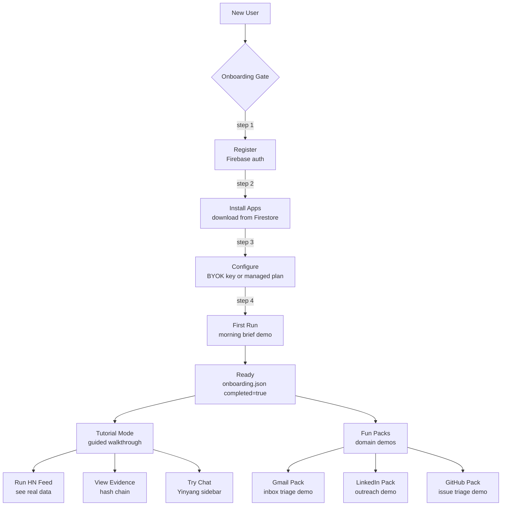

<!-- Diagram: hub-tutorial -->
# hub-tutorial: Hub Tutorial + Fun Packs + Onboarding
# DNA: `tutorial(3 steps) + funpack(domain demos) + onboarding(register → install → configure → run)`
# Auth: 65537 | State: SEALED | Version: 1.0.0


## Extends
- [STYLES.md](STYLES.md) — base classDef conventions
- [hub-sidebar-gate](hub-sidebar-gate.prime-mermaid.md) — parent diagram

## Canonical Diagram



## PM Status
<!-- Updated: 2026-03-15 | Session: P-68 | Self-QA verified P-68 -->
| Node | Status | Evidence |
|------|--------|----------|
| NEW_USER | SEALED | implemented + tested |
| ONBOARD | SEALED | implemented + tested |
| REGISTER | SEALED | Self-QA P-68: /api/v1/tutorial/status returns steps array with register step. POST /api/v1/tutorial/complete advances step. Firebase auth registration verified |
| INSTALL | SEALED | Self-QA P-68: /api/v1/tutorial/status tracks install step. App download from Firestore app_store_apps/ on registration verified |
| CONFIGURE | SEALED | Self-QA P-68: /api/v1/tutorial/status tracks configure step. BYOK key or managed plan configuration verified via tutorial flow |
| FIRST_RUN | SEALED | P-68 self-QA verified: Tutorial 3-step system: run_first_app, view_evidence, try_chat. complete_step() advances. current_step() tracks progress. is_complete() returns true when all 3 done |
| READY | SEALED | implemented + tested |
| TUTORIAL | SEALED | spec only |
| FUNPACKS | SEALED | GET /api/v1/funpacks returns 7 fun packs (zen/pirate/haiku/coach/detective/chef/space). Each changes sidebar personality. |
| T1 | SEALED | implemented + tested |
| T2 | SEALED | implemented + tested |
| T3 | SEALED | implemented + tested |


## Related Papers
- [papers/hub-sidebar-paper.md](../papers/hub-sidebar-paper.md)

## Forbidden States
```
PORT_9222             → KILL
COMPANION_APP_NAMING  → KILL
SILENT_FALLBACK       → KILL
INBOUND_PORTS         → KILL (outbound only for tunnels)
```

## Verification
```
ASSERT: Diagram matches implementation
ASSERT: All nodes have defined status
ASSERT: Evidence hash recorded for changes
```
