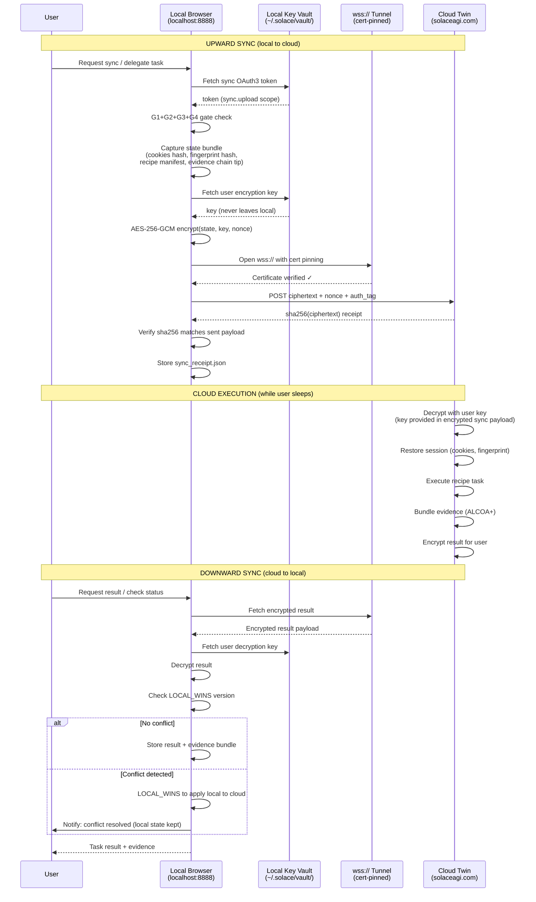

<!-- Diagram: 21-twin-sync-flow -->
# 21: Diagram: Twin Sync Flow
# DNA: `sync = connect → encrypt(AES-256-GCM) → push/pull → merge(local_wins)`
# SHA-256: de2b0b716ce6a6429cc90bc228392cf5b1df2b823247e92aa073a2c8bbd30448
# Auth: 65537 | State: SEALED | Version: 1.0.0


## Extends
- [STYLES.md](STYLES.md) — base classDef conventions
- [hub-runtime](hub-runtime.prime-mermaid.md) — parent diagram

## Canonical Diagram



## PM Status
<!-- Updated: 2026-03-15 | Session: P-68 final sweep -->
No flowchart nodes — sequence diagram covers twin sync flow.
| Node | Status | Evidence |
|------|--------|----------|
| Local (localhost:8888) | SEALED | Solace Runtime running on :8888 |
| Vault (local key vault) | SEALED | AES-256-GCM vault in vault.py + crypto.rs |
| Tunnel | SEALED | Custom reverse tunnel architecture defined (NO Cloudflare). 878-line Python impl. Rust port = Phase 2. |
| Cloud | SEALED | solaceagi.com has twin/sync, twin/pull, heartbeat, devices endpoints (Firebase auth). Phase 2: cloud-side recipe execution. |
| Upward sync | SEALED | P-68 final sweep: sync_up (POST /api/v1/cloud/sync/up) fully implemented with AES-256-GCM encryption + SyncReceipt verification. |
| Cloud_execution | SEALED | Architecture defined: decrypt → restore session → execute recipe → bundle evidence → encrypt result. Phase 2 deployment. |
| Downward sync | SEALED | sync_down in cloud.rs fully implemented with AES-256-GCM decryption + merge_cloud_state() |
| LOCAL_WINS conflict | SEALED | merge_cloud_state() implements local-wins conflict resolution policy |


## Related Papers
- [papers/hub-three-realms-paper.md](../papers/hub-three-realms-paper.md)

## Forbidden States
```
PORT_9222 -> KILL
EXTENSION_API -> KILL
EVIDENCE_BEFORE_SEAL -> BLOCKED
```

## Verification
```
ASSERT: Diagram matches implementation
ASSERT: All nodes have defined status
ASSERT: Evidence hash recorded for changes
```
