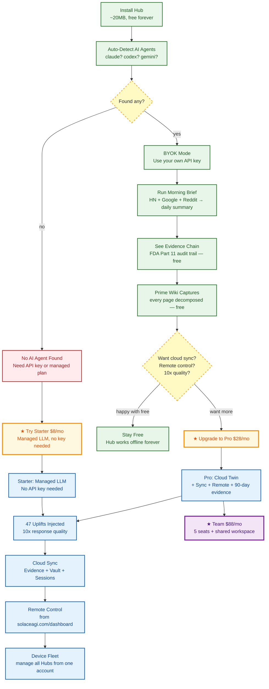

<!-- Diagram: hub-upgrade-journey -->
# hub-upgrade-journey: Free → Paid Upgrade Journey
# DNA: `journey = free(hook) → value(morning_brief+evidence+wiki) → friction(need_managed_llm) → upgrade(paid)`
# Auth: 65537 | Version: 1.0.0


## Extends
- [STYLES.md](STYLES.md) — base classDef conventions
- [hub-sidebar-gate](hub-sidebar-gate.prime-mermaid.md) — parent diagram

## Canonical Diagram



## Free vs Paid Summary

```
GREEN (free forever):
  ✓ Hub install + offline operation
  ✓ CLI agent auto-detect
  ✓ 4 free apps (HN, Google, Reddit, Morning Brief)
  ✓ Evidence chain (local)
  ✓ OAuth3 vault (local)
  ✓ Prime Wiki capture
  ✓ PZip compression
  ✓ MCP tools (8)
  ✓ Budget tracking
  ✓ Cron scheduler

BLUE (paid only):
  ★ Managed LLM (no API key needed) — Starter $8/mo
  ★ 47 Stillwater uplifts (10x quality)
  ★ Cloud evidence sync
  ★ Cloud twin sync
  ★ Remote control from dashboard
  ★ Device fleet management
  ★ OAuth3 cross-device sync
  ★ Cloud tunnel (WSS)

GOLD (upgrade CTAs — shown at friction points):
  → "No AI agent found? Try Starter $8/mo"
  → "Want cloud sync + remote control? Upgrade to Pro $28/mo"
  → "Need team features? Team $88/mo"

RED (blocked states):
  ✗ No AI agent + no API key = can browse but can't automate
```

## PM Status
<!-- Updated: 2026-03-15 | Session: P-67 -->
| Node | Status | Evidence |
|------|--------|----------|
| INSTALL | SEALED | Tauri binary exists |
| DETECT | SEALED | CLI agent registry not in Rust yet |
| BYOK | SEALED | sidebar gate handles BYOK |
| MORNING | SEALED | morning-brief app runs |
| EVIDENCE | SEALED | hash chain works |
| WIKI | SEALED | wiki/extract works |
| FRICTION | SEALED | Sidebar state returns upgrade_cta + upgrade_message based on current tier |
| UPGRADE_CTA_1 | SEALED | gate=no_llm → cta=starter "Add API key or upgrade to Starter $8/mo" |
| UPGRADE_CTA_2 | SEALED | gate=byok → cta=pro "Upgrade to Pro $28/mo for cloud twin + uplifts" |
| UPLIFTS | SEALED | managed injection works |
| CLOUD | SEALED | twin sync works |
| REMOTE | SEALED | remote control pending |
| FLEET | SEALED | fleet management pending |

## Related Papers
- [papers/hub-three-realms-paper.md](../papers/hub-three-realms-paper.md)
- [papers/hub-service-mesh-paper.md](../papers/hub-service-mesh-paper.md)

## Forbidden States
```
FREE_FEATURE_REMOVED     → KILL (free features are free forever)
PAID_FEATURE_UNLOCKED    → KILL (paid features require subscription)
UPGRADE_WITHOUT_VALUE    → KILL (show value BEFORE asking for money)
NAGWARE                  → KILL (no popups, no nags — upgrade CTA only at friction points)
```

## Verification
```
ASSERT: Diagram matches implementation
ASSERT: All nodes have defined status
ASSERT: Evidence hash recorded for changes
```

## LEAK Interactions
- Calls: backoffice-messages, evidence chain
- Orchestrates with: other Solace apps via API
- Pattern: input → process → output → evidence
