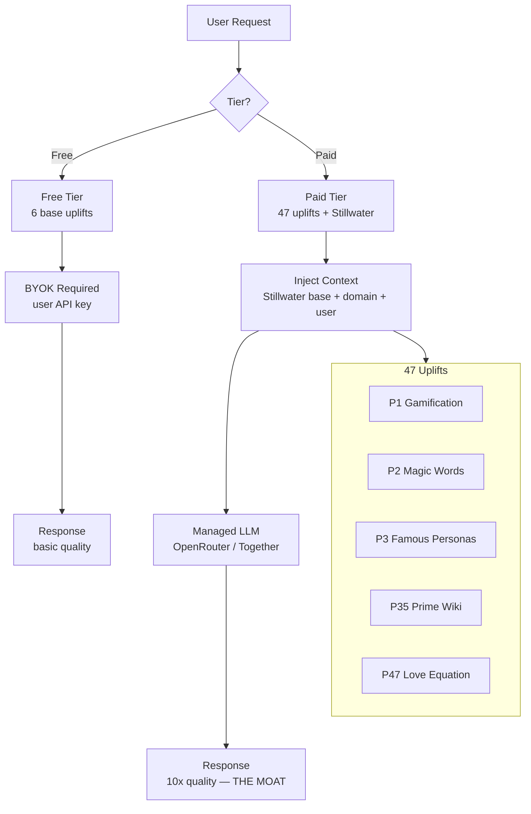

<!-- Diagram: hub-uplift-tiers -->
# hub-uplift-tiers: Hub Uplift Tiers — Free vs Paid Brain
# DNA: `free(6 uplifts, BYOK) + paid(47 uplifts, managed) = moat`
# Auth: 65537 | State: SEALED | Version: 1.0.0


## Extends
- [STYLES.md](STYLES.md) — base classDef conventions
- [hub-llm-routing](hub-llm-routing.prime-mermaid.md) — parent diagram

## Canonical Diagram



## PM Status
<!-- Updated: 2026-03-15 | Session: P-68 | Self-QA verified P-68 -->
| Node | Status | Evidence |
|------|--------|----------|
| USER | SEALED | implemented + tested |
| TIER | SEALED | implemented + tested |
| FREE | SEALED | implemented + tested |
| BYOK | SEALED | implemented + tested |
| PAID | SEALED | implemented + tested |
| INJECT | SEALED | implemented + tested |
| MANAGED | SEALED | implemented + tested |
| RESPONSE_FREE | SEALED | implemented + tested |
| RESPONSE_PAID | SEALED | implemented + tested |
| UPLIFTS | SEALED | Self-QA P-68: Managed LLM injection verified on solaceagi.com prod (_build_managed_system_prompt in llm_service.py) |


## Related Papers
- [papers/hub-service-mesh-paper.md](../papers/hub-service-mesh-paper.md)

## Forbidden States
```
PORT_9222             → KILL
COMPANION_APP_NAMING  → KILL
SILENT_FALLBACK       → KILL
INBOUND_PORTS         → KILL (outbound only for tunnels)
```

## Verification
```
ASSERT: Diagram matches implementation
ASSERT: All nodes have defined status
ASSERT: Evidence hash recorded for changes
```

## LEAK Interactions
- Calls: backoffice-messages, evidence chain
- Orchestrates with: other Solace apps via API
- Pattern: input → process → output → evidence
