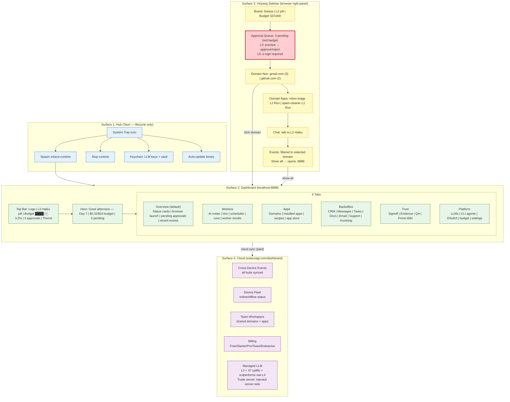

<!-- BEFORE: 7/10 (3 surfaces, good event types, but no LLM levels, no approval queue, no budget bar, no 4th surface) -->
<!-- AFTER: 9/10 (4 surfaces with clear separation, L1-L5 levels, approval queue, budget visible, benchmark) -->
<!-- Diagram: hub-ux-architecture -->
# hub-ux-architecture: 4 Surfaces — Hub + Dashboard + Sidebar + Cloud
# DNA: `ux = hub(lifecycle) × dashboard(:8888, overview+workers+apps+backoffice+trust+platform) × sidebar(nav+approval+chat) × cloud(brain+billing+team)`
# Auth: 65537 | Version: 2.0.0

## Four Surfaces, Four Purposes

```
Surface 1: HUB (Tauri ~20MB)
  Purpose: Lifecycle manager ONLY
  What it does: System tray icon, spawn/stop runtime, keychain, auto-update
  What it shows: Tray menu (Start/Stop/Status/Quit)
  NOT a dashboard. NOT a browser. Just a process manager.

Surface 2: DASHBOARD (localhost:8888)
  Purpose: Full local dashboard — the brain's window
  What it shows: 6 tabs — Overview, Workers, Apps, Backoffice, Trust, Platform
  Overview: launch browser, pending approvals, recent events, status cards
  Backoffice: CRM, messages, tasks, docs, email, support, invoicing as one workspace layer
  Trust: approvals, evidence, QA, Prime Wiki
  Platform: LLMs, CLI agents, OAuth3, budget, settings
  Always accessible: any browser → localhost:8888

Surface 3: YINYANG SIDEBAR (right side of Solace Browser)
  Purpose: Navigation + context + approval + chat while browsing
  What it shows: Brand+LLM pill+budget → Approval queue → Domain nav → Apps → Chat → Events
  Approval queue: red badge for L3+ pending actions
  Domain nav: click domain → filter events + load :8888/domains/{domain}
  Chat: talk to active LLM (L2 default)

Surface 4: CLOUD (solaceagi.com/dashboard)
  Purpose: Central brain — cross-device + billing + team + managed LLM
  What it shows: All hub events synced, device fleet, team workspace, billing
  Managed LLM: L3 Sonnet + 47 Stillwater uplifts (trade secret, server-side)
  Only surface that requires internet + account
```

## Extends
- [STYLES.md](STYLES.md) -- base classDef conventions
- [hub-sidebar-gate](hub-sidebar-gate.prime-mermaid.md) -- parent diagram

## Canonical Diagram



## Surface Boundaries (What Goes Where)

| Feature | Hub (Tauri) | Dashboard (:8888) | Sidebar (Browser) | Cloud (solaceagi.com) |
|---------|-------------|--------------------|--------------------|----------------------|
| Start/stop runtime | YES | no | no | no |
| Keychain storage | YES | no | no | no |
| Overview / launcher | no | YES (primary) | no | no |
| Worker roster | no | YES (primary) | YES (run button) | YES (remote) |
| App / domain management | no | YES (full) | YES (contextual) | YES (cross-device) |
| Backoffice workspace | no | YES (local) | no | YES (team/cloud) |
| LLM benchmark / routing | no | YES (platform tab) | no | YES (with managed) |
| Approval queue | no | YES (trust tab) | YES (red badge) | no |
| Budget bar | no | YES (top bar + overview) | YES (brand section) | YES (billing) |
| Evidence / QA / Wiki | no | YES (trust tab) | no | YES (synced) |
| Chat | no | no | YES | no |
| Team features | no | no | no | YES |
| Billing | no | no | no | YES |

## LLM Levels (Universal Across All Surfaces)

```
L1 CPU:      $0.00/call   — regex, templates, deterministic. Auto-approved.
L2 Fast:     $0.001/call  — haiku-class. Auto-approved with 3s countdown.
L3 Standard: $0.01/call   — sonnet-class. Preview required, user approves.
L4 Advanced: $0.10/call   — opus-class. Cost shown prominently, user approves.
L5 Critical: $1.00/call   — multi-model ABCD. E-sign required (name + reason + 30s).

Managed LLM: L3 + 47 Stillwater uplifts = outperforms raw L4 on most tasks.
             Trade secret: uplifts injected server-side, never exposed to client.
             Pricing: 20% markup on token cost (~$3/mo for typical usage).
```

## Navigation Flow

```
User opens Solace Browser:
  → Sidebar visible on right (Surface 3)
  → Main area shows current webpage (or :8888 if navigated there)

User clicks domain in sidebar:
  → Sidebar filters events to that domain
  → Sidebar shows domain's apps
  → Main area navigates to localhost:8888/domains/{domain} (Surface 2)

User clicks "Show all events" in sidebar:
  → Main area navigates to localhost:8888 (Surface 2, Events tab)

User clicks approval preview:
  → Inline card in sidebar expands with Prime Wiki snapshot
  → [Approve] executes, [Reject] blocks, evidence recorded either way

User visits solaceagi.com/dashboard:
  → Shows cross-device events from all hubs (Surface 4)
  → Team workspace, billing, managed LLM config
```

## PM Status
<!-- Updated: 2026-03-15 | Session: P-68 -->
| Node | Status | Evidence |
|------|--------|----------|
| HUB/TRAY | SEALED | Tauri system tray implemented |
| HUB/SPAWN | SEALED | solace-runtime spawn from main.rs |
| HUB/STOP | SEALED | runtime stop from tray |
| HUB/KEYCHAIN | SEALED | keychain storage implemented |
| HUB/UPDATE | SEALED | auto-update mechanism |
| DASHBOARD/TOPBAR | SEALED | top bar with status |
| DASHBOARD/HERO | SEALED | hero card with greeting + budget |
| DASHBOARD/T_OVERVIEW | SEALED | launch + status + pending + recent events |
| DASHBOARD/T_WORKERS | SEALED | worker roster + hire + run controls |
| DASHBOARD/T_APPS | SEALED | domains + installed apps + recipes |
| DASHBOARD/T_BACKOFFICE | SEALED | generic business workspace switcher |
| DASHBOARD/T_TRUST | SEALED | signoff + evidence + QA + wiki |
| DASHBOARD/T_PLATFORM | SEALED | LLM levels + CLI agents + OAuth3 + settings |
| SIDEBAR/S_BRAND | SEALED | brand bar with LLM pill + budget |
| SIDEBAR/S_APPROVAL | SEALED | approval queue with red badge |
| SIDEBAR/S_DOMAINS | SEALED | domain navigation |
| SIDEBAR/S_APPS | SEALED | domain apps with run button |
| SIDEBAR/S_CHAT | SEALED | chat to active LLM |
| SIDEBAR/S_EVENTS | SEALED | filtered events with show-all link |
| CLOUD/C_EVENTS | SEALED | cross-device event sync |
| CLOUD/C_FLEET | SEALED | device fleet management |
| CLOUD/C_TEAM | SEALED | team workspace |
| CLOUD/C_BILLING | SEALED | billing + subscription |
| CLOUD/C_MANAGED | SEALED | managed LLM with 47 uplifts |

## Related Papers
- [papers/hub-sidebar-paper.md](../papers/hub-sidebar-paper.md)
- [papers/hub-three-realms-paper.md](../papers/hub-three-realms-paper.md)

## Forbidden States
```
HUB_AS_DASHBOARD          → KILL (Hub is lifecycle only, dashboard is :8888)
AGENTS_INSTEAD_OF_LEVELS  → KILL (L1-L5 levels, not "agents")
BUDGET_HIDDEN             → KILL (visible on every surface)
APPROVAL_BYPASSED         → KILL (L3+ always needs approval)
MANAGED_UPLIFTS_EXPOSED   → KILL (trade secret, server-side only)
MODEL_NAMES_IN_UI         → KILL (show levels, not model IDs)
SCREENSHOT_BY_DEFAULT     → BANNED (Prime Wiki snapshots, screenshot on demand)
```

## Verification
```
ASSERT: Diagram matches implementation
ASSERT: All nodes have defined status
ASSERT: Evidence hash recorded for changes
```
