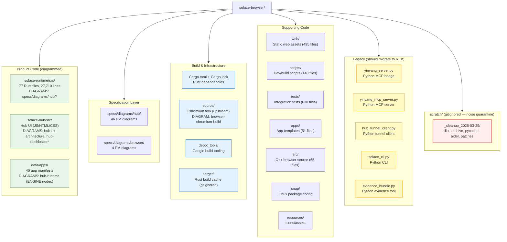

<!-- Diagram: project-map -->
# Solace Browser — Project Map
# DNA: `project = runtime(rust,27K) + hub(tauri,UI) + data(40_apps) + diagrams(50) + chromium(fork)`
# Auth: 65537 | State: GOOD | Version: 1.0.0

## Directory Map



## Coverage Rule
Every file outside `scratch/`, `target/`, `source/`, `depot_tools/`, and `.git/`
MUST be referenced by at least one PM diagram's `## Covered Files` section.

## File → Diagram Index

| Path | Diagram |
|------|---------|
| `solace-runtime/src/main.rs` | hub-runtime |
| `solace-runtime/src/server.rs` | hub-runtime |
| `solace-runtime/src/state.rs` | hub-runtime |
| `solace-runtime/src/routes/*.rs` (38 files) | hub-runtime + specific feature diagrams |
| `solace-runtime/src/app_engine/*.rs` | hub-runtime, hub-llm-routing, hub-cross-app |
| `solace-runtime/src/backoffice/*.rs` | hub-cloud-backoffice, hub-runtime |
| `solace-runtime/src/pzip/*.rs` | hub-evidence |
| `solace-runtime/src/auth/*.rs` | hub-runtime |
| `solace-runtime/src/mcp.rs` | hub-mcp |
| `solace-runtime/src/cron.rs` | hub-cron |
| `solace-runtime/src/cloud.rs` | hub-runtime |
| `solace-runtime/src/crypto.rs` | hub-runtime |
| `solace-runtime/src/persistence.rs` | hub-runtime |
| `solace-runtime/src/evidence.rs` | hub-evidence |
| `solace-runtime/src/event_log.rs` | hub-app-event-log |
| `solace-runtime/src/updates.rs` | hub-runtime |
| `solace-hub/src/*` | hub-ux-architecture, hub-dashboard |
| `data/apps/` | hub-runtime |
| `yinyang_server.py` | hub-runtime (LEGACY) |
| `web/` | hub-ux-architecture |
| `scripts/` | browser-chromium-build |
| `tests/` | Referenced in diagram Verification sections |
| `.gitignore` | project-map |
| `apps/README.md` | hub-domain-ecosystem |
| `Dockerfile.cloud-twin` | hub-deployment-pipeline |
| `cloudbuild-twin.yaml` | hub-deployment-pipeline |

### Top-Level Config & Documentation
| File | Purpose |
|------|---------|
| `Cargo.toml` | Rust manifest — defines solace-runtime crate |
| `Makefile` | Build automation — `make build`, `make test` |
| `README.md` | Project documentation |
| `ROADMAP.md` | Product roadmap (1,379 lines) |
| `TODO.md` | Active task list |
| `NORTHSTAR.md` | Project vision / north star |
| `CHANGELOG.md` | Version history |
| `CONTRIBUTING.md` | Contribution guidelines |
| `SECURITY.md` | Security policy |
| `CLAUDE.md` | AI coding agent instructions |
| `GEMINI.md` | AI coding agent instructions |
| `cloudbuild.yaml` | GCP Cloud Build main config |
| `cloudbuild-prod.yaml` | GCP Cloud Build production |
| `cloudbuild-browser.yaml` | GCP Cloud Build browser |
| `docker-compose.yml` | Docker orchestration |
| `docker-compose.dev.yml` | Docker dev environment |
| `requirements.txt` | Python dependencies |
| `requirements-lock.txt` | Python dependency lock |
| `pyproject.toml` | Python project config |
| `pytest.ini` | Python test config |
| `ruff.toml` | Python linter config |
| `load_env.sh` | Environment variable loader |
| `sbom.json` | Software Bill of Materials |

## Covered Files
```
docs:
  - solace-browser/README.md
  - solace-browser/ROADMAP.md
  - solace-browser/TODO.md
  - solace-browser/NORTHSTAR.md
  - solace-browser/CHANGELOG.md
  - solace-browser/CONTRIBUTING.md
  - solace-browser/SECURITY.md
  - solace-browser/CLAUDE.md
  - solace-browser/GEMINI.md
config:
  - solace-browser/.gitignore
  - solace-browser/Cargo.toml
  - solace-browser/Makefile
  - solace-browser/cloudbuild.yaml
  - solace-browser/cloudbuild-prod.yaml
  - solace-browser/cloudbuild-browser.yaml
  - solace-browser/docker-compose.yml
  - solace-browser/docker-compose.dev.yml
  - solace-browser/requirements.txt
  - solace-browser/requirements-lock.txt
  - solace-browser/pyproject.toml
  - solace-browser/pytest.ini
  - solace-browser/ruff.toml
  - solace-browser/load_env.sh
  - solace-browser/sbom.json
```
