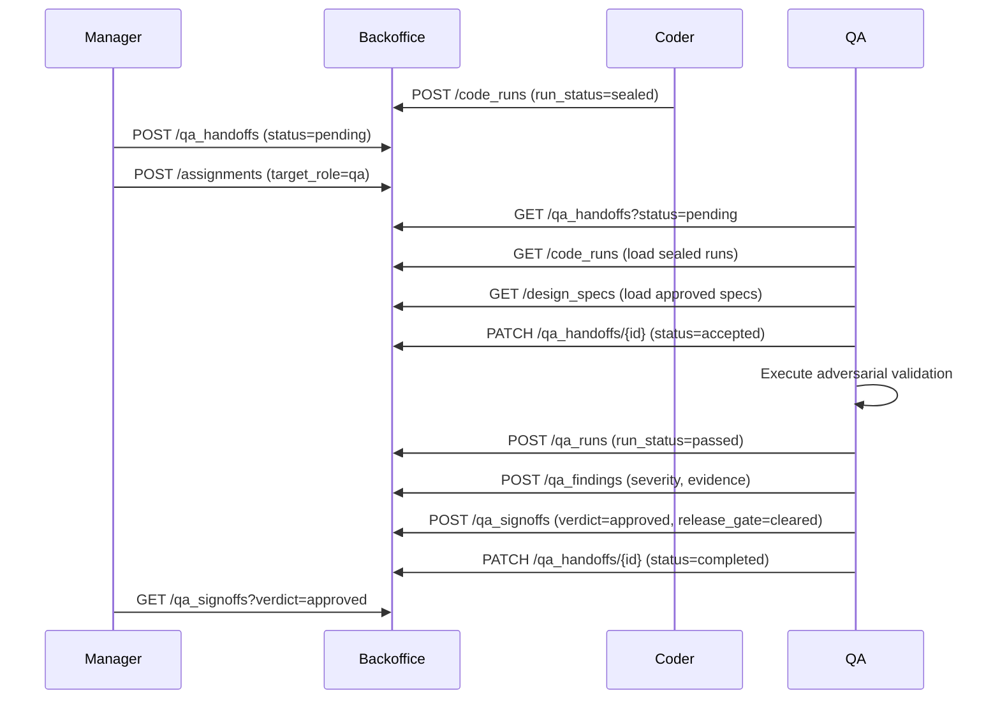

# Coder-to-QA Handoff Contract

## Purpose

Defines the explicit object contract for what the manager and coder pass to QA when routing a bounded assignment with `target_role = qa`.

## Handoff Record Schema

| Field | Type | Required | Description |
|-------|------|----------|-------------|
| `request_id` | ref:requests | yes | Source request from the manager pipeline |
| `assignment_id` | ref:assignments | yes | Bounded assignment created by the manager |
| `project_id` | ref:projects | yes | Target project scope |
| `code_run_refs` | text | yes | Comma-separated IDs of sealed code runs to validate |
| `design_spec_refs` | text | yes | Comma-separated IDs of approved design specs that bound the implementation |
| `assertions` | text | no | Expected assertions or regression checks |
| `evidence_refs` | text | no | Prior evidence artifacts to verify against |
| `constraints` | text | no | QA constraints (adversarial depth, performance, accessibility) |
| `expected_artifacts` | text | yes | What QA must produce (e.g., "findings, signoff, release_gate_verdict") |
| `status` | enum | yes | `pending` → `accepted` → `completed` |

## Storage

Handoff records live in the `qa_handoffs` backoffice table under `solace-dev-manager`.

**REST endpoint**: `POST /api/v1/backoffice/solace-dev-manager/qa_handoffs`

## Sample Payload

```json
{
  "request_id": "req-003",
  "assignment_id": "asgn-005",
  "project_id": "proj-solace-browser",
  "code_run_refs": "run-001, run-002",
  "design_spec_refs": "spec-page-map-001, spec-ui-state-001",
  "assertions": "all existing tests pass, no UI state regressions, design spec compliance",
  "evidence_refs": "evidence-hash-abc123",
  "constraints": "adversarial, accessibility audit, performance within O(10ms) IPC",
  "expected_artifacts": "findings, signoff, release_gate_verdict",
  "status": "pending"
}
```

## Flow


