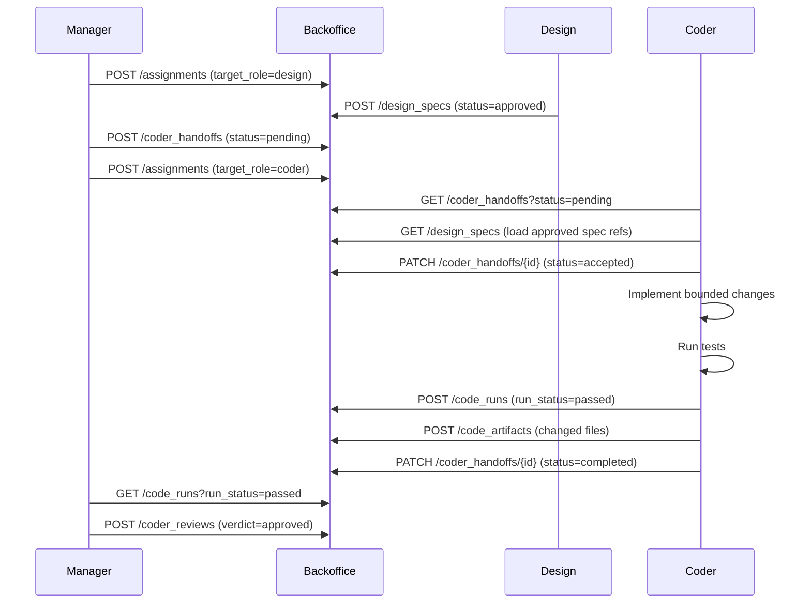

# Design-to-Coder Handoff Contract

## Purpose

Defines the explicit object contract for what the manager and design pass to coder when routing a bounded assignment with `target_role = coder`.

## Handoff Record Schema

| Field | Type | Required | Description |
|-------|------|----------|-------------|
| `request_id` | ref:requests | yes | Source request from the manager pipeline |
| `assignment_id` | ref:assignments | yes | Bounded assignment created by the manager |
| `project_id` | ref:projects | yes | Target project scope |
| `design_spec_refs` | text | yes | Comma-separated IDs of approved design specs that bound this implementation |
| `target_files` | text | yes | Expected files or file areas to change |
| `page_scope` | text | no | Page identifiers from the project page map |
| `state_scope` | text | no | UI states the implementation must address |
| `constraints` | text | no | Implementation constraints (backward compat, performance, test coverage) |
| `expected_artifacts` | text | yes | What coder must produce (e.g., "changed_files, diff_summary, test_output") |
| `status` | enum | yes | `pending` → `accepted` → `completed` |

## Storage

Handoff records live in the `coder_handoffs` backoffice table under `solace-dev-manager`.

**REST endpoint**: `POST /api/v1/backoffice/solace-dev-manager/coder_handoffs`

## Sample Payload

```json
{
  "request_id": "req-002",
  "assignment_id": "asgn-003",
  "project_id": "proj-solace-browser",
  "design_spec_refs": "spec-page-map-001, spec-ui-state-001",
  "target_files": "solace-hub/src/index.html, solace-hub/src/hub-app.js",
  "page_scope": "dev_workspace",
  "state_scope": "manager_view → design_view → coder_view",
  "constraints": "backward-compatible, existing sb- design system, all existing tests must pass",
  "expected_artifacts": "changed_files, diff_summary, test_output, evidence_hash",
  "status": "pending"
}
```

## Flow


