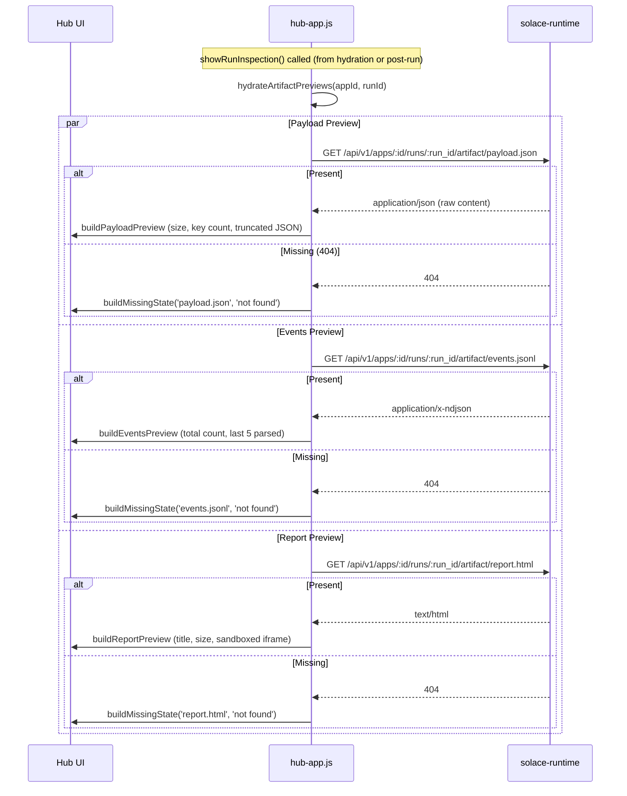

# Workspace-Native Artifact Preview Flow

Governs: how the Dev workspace fetches and renders inline artifact previews.

```mermaid
sequenceDiagram
    participant U as Hub UI
    participant JS as hub-app.js
    participant RT as solace-runtime

    Note over JS: showRunInspection() called (from hydration or post-run)
    JS->>JS: hydrateArtifactPreviews(appId, runId)

    par Payload Preview
        JS->>RT: GET /api/v1/apps/:id/runs/:run_id/artifact/payload.json
        alt Present
            RT-->>JS: application/json (raw content)
            JS->>U: buildPayloadPreview (size, key count, truncated JSON)
        else Missing (404)
            RT-->>JS: 404
            JS->>U: buildMissingState('payload.json', 'not found')
        end
    and Events Preview
        JS->>RT: GET /api/v1/apps/:id/runs/:run_id/artifact/events.jsonl
        alt Present
            RT-->>JS: application/x-ndjson
            JS->>U: buildEventsPreview (total count, last 5 parsed)
        else Missing
            RT-->>JS: 404
            JS->>U: buildMissingState('events.jsonl', 'not found')
        end
    and Report Preview
        JS->>RT: GET /api/v1/apps/:id/runs/:run_id/artifact/report.html
        alt Present
            RT-->>JS: text/html
            JS->>U: buildReportPreview (title, size, sandboxed iframe)
        else Missing
            RT-->>JS: 404
            JS->>U: buildMissingState('report.html', 'not found')
        end
    end
```
