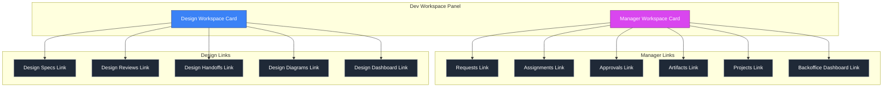

# Browser Component-State Map

```mermaid
graph TD
    classDef manager fill:#d946ef,stroke:#701a75,color:#fff
    classDef design fill:#3b82f6,stroke:#1e3a8a,color:#fff
    classDef backoffice fill:#1f2937,stroke:#9ca3af,color:#fff

    subgraph Dev Workspace Panel
        ManagerCard[Manager Workspace Card]:::manager
        DesignCard[Design Workspace Card]:::design
    end

    subgraph Manager Links
        ReqLink[Requests Link]:::backoffice
        AssignLink[Assignments Link]:::backoffice
        ApprovalLink[Approvals Link]:::backoffice
        ArtifactLink[Artifacts Link]:::backoffice
        ProjectLink[Projects Link]:::backoffice
        ManagerDash[Backoffice Dashboard Link]:::backoffice
    end

    subgraph Design Links
        SpecsLink[Design Specs Link]:::backoffice
        ReviewsLink[Design Reviews Link]:::backoffice
        HandoffsLink[Design Handoffs Link]:::backoffice
        DiagramsLink[Design Diagrams Link]:::backoffice
        DesignDash[Design Dashboard Link]:::backoffice
    end

    ManagerCard --> ReqLink
    ManagerCard --> AssignLink
    ManagerCard --> ApprovalLink
    ManagerCard --> ArtifactLink
    ManagerCard --> ProjectLink
    ManagerCard --> ManagerDash

    DesignCard --> SpecsLink
    DesignCard --> ReviewsLink
    DesignCard --> HandoffsLink
    DesignCard --> DiagramsLink
    DesignCard --> DesignDash
```
