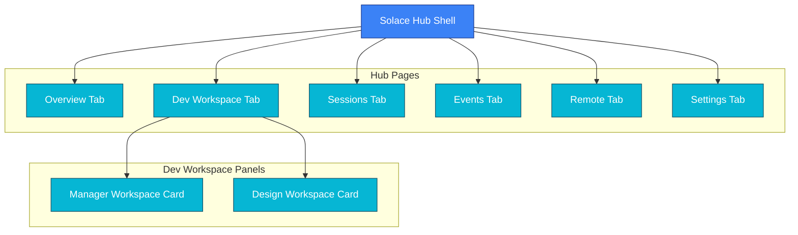

# Browser Page Map

```mermaid
graph TD
    classDef page fill:#3b82f6,stroke:#1e3a8a,color:#fff
    classDef panel fill:#06b6d4,stroke:#164e63,color:#fff

    Hub[Solace Hub Shell]:::page

    subgraph Hub Pages
        Overview[Overview Tab]:::panel
        DevWorkspace[Dev Workspace Tab]:::panel
        Sessions[Sessions Tab]:::panel
        Events[Events Tab]:::panel
        Remote[Remote Tab]:::panel
        Settings[Settings Tab]:::panel
    end

    subgraph Dev Workspace Panels
        ManagerPanel[Manager Workspace Card]:::panel
        DesignPanel[Design Workspace Card]:::panel
    end

    Hub --> Overview
    Hub --> DevWorkspace
    Hub --> Sessions
    Hub --> Events
    Hub --> Remote
    Hub --> Settings

    DevWorkspace --> ManagerPanel
    DevWorkspace --> DesignPanel
```
