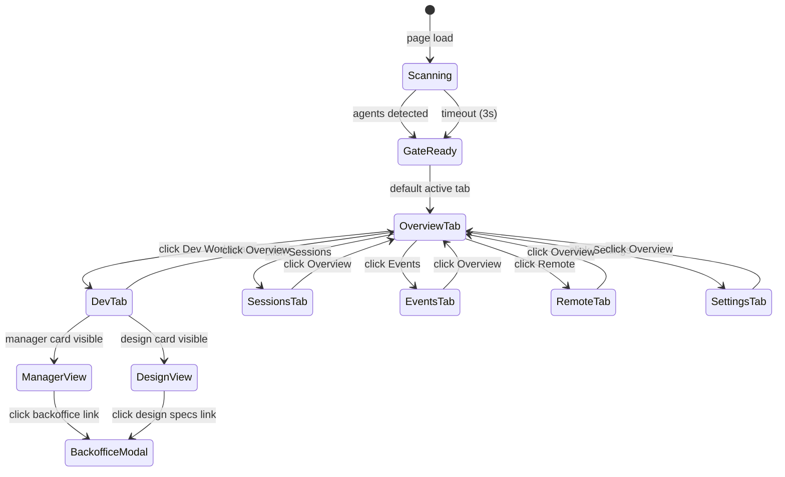

# Browser UI State Map

```mermaid
stateDiagram-v2
    [*] --> Scanning : page load
    Scanning --> GateReady : agents detected
    Scanning --> GateReady : timeout (3s)
    GateReady --> OverviewTab : default active tab
    OverviewTab --> DevTab : click Dev Workspace
    OverviewTab --> SessionsTab : click Sessions
    OverviewTab --> EventsTab : click Events
    OverviewTab --> RemoteTab : click Remote
    OverviewTab --> SettingsTab : click Settings
    DevTab --> OverviewTab : click Overview
    DevTab --> ManagerView : manager card visible
    DevTab --> DesignView : design card visible
    ManagerView --> BackofficeModal : click backoffice link
    DesignView --> BackofficeModal : click design specs link
    SessionsTab --> OverviewTab : click Overview
    EventsTab --> OverviewTab : click Overview
    RemoteTab --> OverviewTab : click Overview
    SettingsTab --> OverviewTab : click Overview
```
