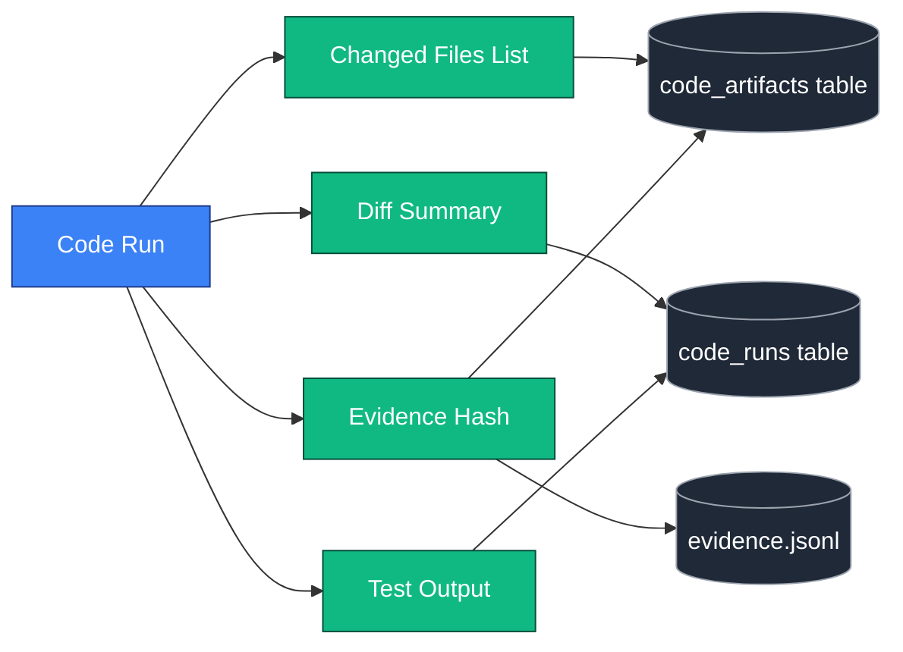

# Coder Artifact Flow

```mermaid
flowchart LR
    classDef source fill:#3b82f6,stroke:#1e3a8a,color:#fff
    classDef artifact fill:#10b981,stroke:#064e3b,color:#fff
    classDef store fill:#1f2937,stroke:#9ca3af,color:#fff

    CodeRun[Code Run]:::source --> ChangedFiles[Changed Files List]:::artifact
    CodeRun --> DiffSummary[Diff Summary]:::artifact
    CodeRun --> TestOutput[Test Output]:::artifact
    CodeRun --> EvidenceHash[Evidence Hash]:::artifact

    ChangedFiles --> CodeArtifacts[(code_artifacts table)]:::store
    DiffSummary --> CodeRunRecord[(code_runs table)]:::store
    TestOutput --> CodeRunRecord
    EvidenceHash --> CodeArtifacts
    EvidenceHash --> EvidenceLog[(evidence.jsonl)]:::store
```
