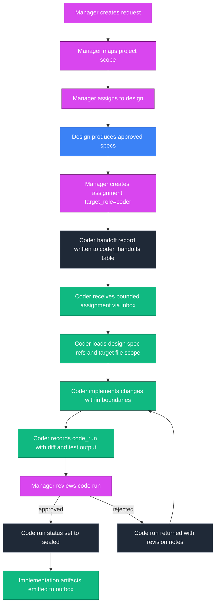

# Coder Implementation Handoff

```mermaid
flowchart TD
    classDef manager fill:#d946ef,stroke:#701a75,color:#fff
    classDef design fill:#3b82f6,stroke:#1e3a8a,color:#fff
    classDef coder fill:#10b981,stroke:#064e3b,color:#fff
    classDef object fill:#1f2937,stroke:#9ca3af,color:#fff

    A[Manager creates request]:::manager --> B[Manager maps project scope]:::manager
    B --> C[Manager assigns to design]:::manager
    C --> D[Design produces approved specs]:::design
    D --> E[Manager creates assignment target_role=coder]:::manager
    E --> F[Coder handoff record written to coder_handoffs table]:::object
    F --> G[Coder receives bounded assignment via inbox]:::coder
    G --> H[Coder loads design spec refs and target file scope]:::coder
    H --> I[Coder implements changes within boundaries]:::coder
    I --> J[Coder records code_run with diff and test output]:::coder
    J --> K[Manager reviews code run]:::manager
    K -->|approved| L[Code run status set to sealed]:::object
    K -->|rejected| M[Code run returned with revision notes]:::object
    M --> I
    L --> N[Implementation artifacts emitted to outbox]:::coder
```
