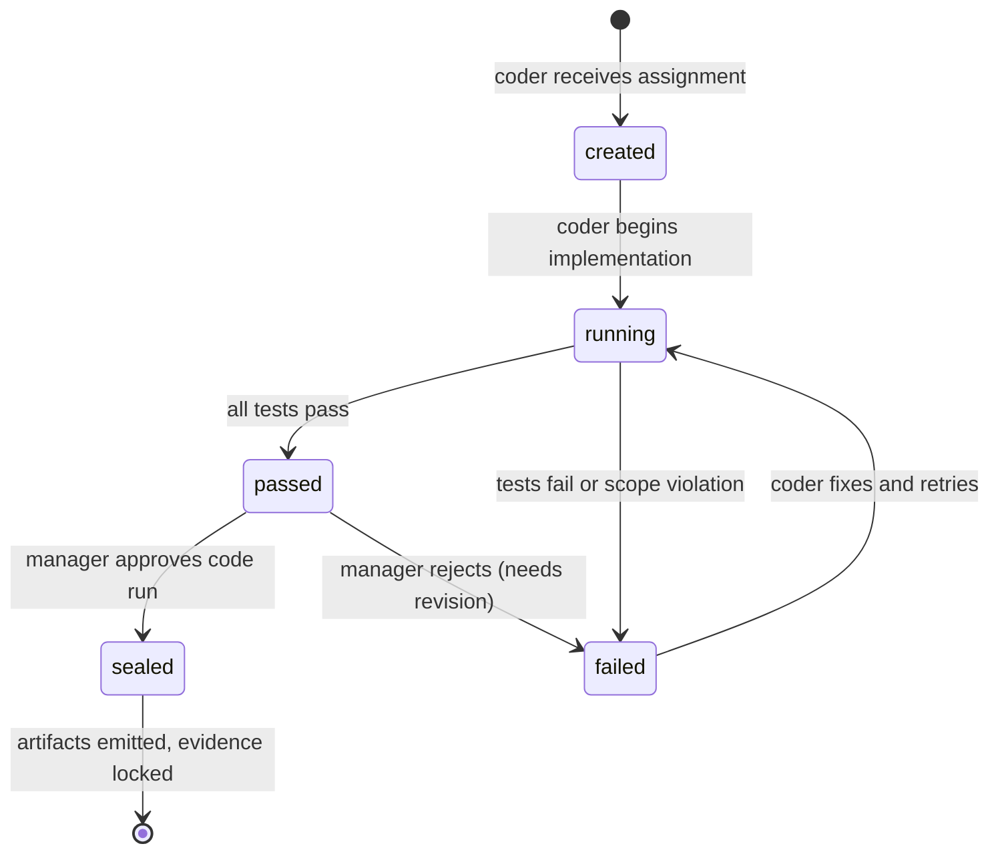

# Code-Run Lifecycle

```mermaid
stateDiagram-v2
    [*] --> created : coder receives assignment
    created --> running : coder begins implementation
    running --> passed : all tests pass
    running --> failed : tests fail or scope violation
    failed --> running : coder fixes and retries
    passed --> sealed : manager approves code run
    passed --> failed : manager rejects (needs revision)
    sealed --> [*] : artifacts emitted, evidence locked
```
