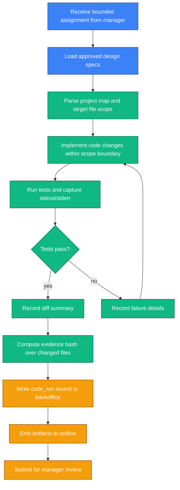

# Coder Workflow

```mermaid
flowchart TD
    classDef coder fill:#10b981,stroke:#064e3b,color:#fff
    classDef input fill:#3b82f6,stroke:#1e3a8a,color:#fff
    classDef output fill:#f59e0b,stroke:#78350f,color:#fff

    A[Receive bounded assignment from manager]:::input --> B[Load approved design specs]:::input
    B --> C[Parse project map and target file scope]:::coder
    C --> D[Implement code changes within scope boundary]:::coder
    D --> E[Run tests and capture stdout/stderr]:::coder
    E --> F{Tests pass?}:::coder
    F -->|yes| G[Record diff summary]:::coder
    F -->|no| H[Record failure details]:::coder
    H --> D
    G --> I[Compute evidence hash over changed files]:::coder
    I --> J[Write code_run record to backoffice]:::output
    J --> K[Emit artifacts to outbox]:::output
    K --> L[Submit for manager review]:::output
```
