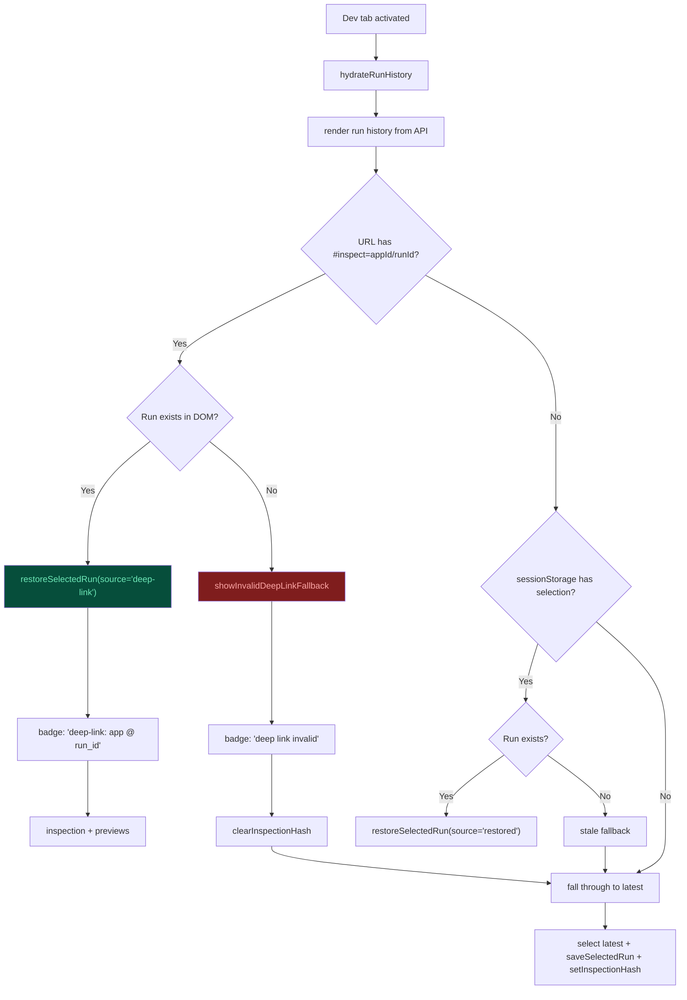

# Deep-Link Inspection Flow

Governs: how URL hash state (`#inspect=appId/runId`) provides explicit, shareable inspection context.



## Precedence Rule

```
1. URL hash (#inspect=appId/runId)  ← explicit, shareable
2. sessionStorage                   ← same-tab persistence
3. Latest run across all roles      ← default fallback
```
