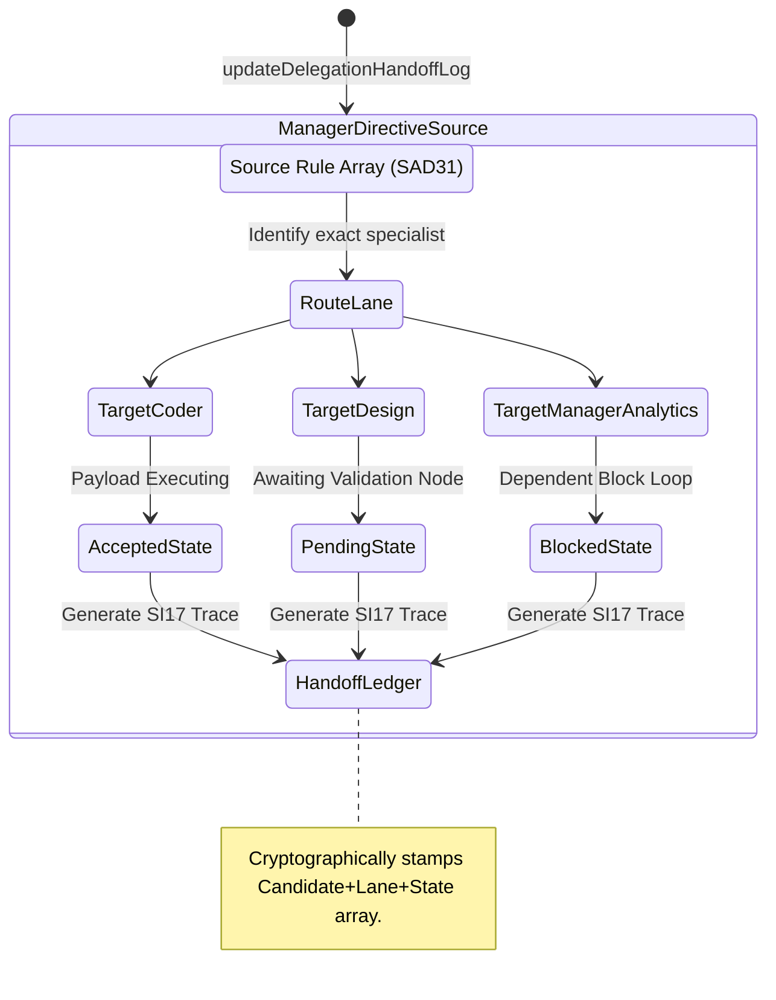

<!-- Diagram: 24-cpu-swarm-node-architecture -->
---
target_schema: prime-mermaid-v1
confidence: verification_gated
author: Grace Hopper (QA Diagrammer constraints)
description: Formal topology representing the handover vector from explicit Manager Directives (SAD31) into specialist lanes arrays (Coder, QA, Design) yielding execution status loops.
context_paper: SI17 Human-in-the-Loop
---

# Structure: Delegation Handoff Log

Resolving Manager delegation bounds directly into actionable dispatch payloads. The system visually tracks the state receipt returned by specialist queue infrastructure locking hallucination out of the Dev environment.

## State Dictionary
- `DirectiveOutbox`: The boundary node transitioning intention into queue payload.
- `RouteLane`: Ensuring exact structural assignment.
- `AcceptedState / PendingState / BlockedState`: Strict pipeline metrics preventing managerial assumed conclusions (false successes).
- `HandoffLedger`: The final logging array producing the ALCOA+ string representation.
