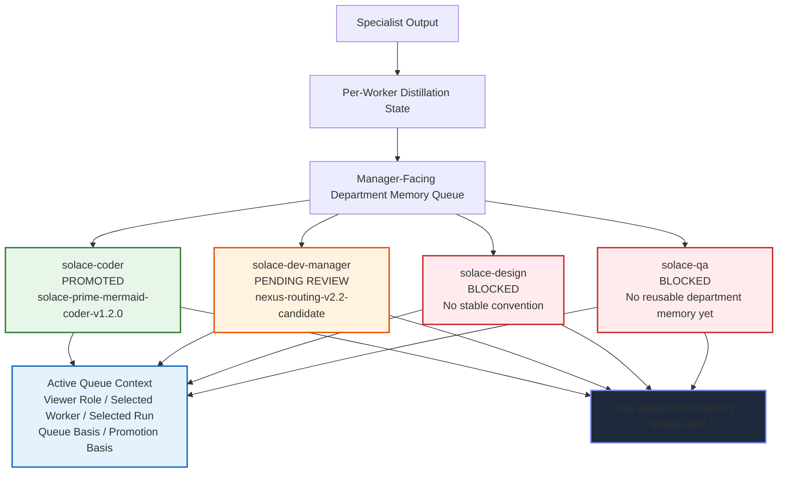

# Department Memory Queue & Promotion Review

Governs: how the Dev Manager reviews promoted, pending, and blocked convention candidates across specialists as department memory.

```mermaid
flowchart TD
    A[Specialist Output] --> B[Per-Worker Distillation State]
    B --> C[Manager-Facing Department Memory Queue]

    C --> D1["solace-coder\nPROMOTED\nsolace-prime-mermaid-coder-v1.2.0"]
    C --> D2["solace-dev-manager\nPENDING REVIEW\nnexus-routing-v2.2-candidate"]
    C --> D3["solace-design\nBLOCKED\nNo stable convention"]
    C --> D4["solace-qa\nBLOCKED\nNo reusable department memory yet"]

    D1 --> CTX["Active Queue Context\nViewer Role / Selected Worker / Selected Run\nQueue Basis / Promotion Basis"]
    D2 --> CTX
    D3 --> CTX
    D4 --> CTX

    D1 --> UI[dev-department-memory-queue-card]
    D2 --> UI
    D3 --> UI
    D4 --> UI

    classDef pass fill:#e8f5e9,stroke:#2e7d32,stroke-width:2px
    classDef warn fill:#fff3e0,stroke:#e65100,stroke-width:2px
    classDef fail fill:#ffebee,stroke:#c62828,stroke-width:2px
    classDef info fill:#e3f2fd,stroke:#1565c0,stroke-width:2px

    class D1 pass
    class D2 warn
    class D3 fail
    class D4 fail
    class CTX info

    style UI fill:#1e293b,stroke:#818cf8,stroke-width:2px
```
