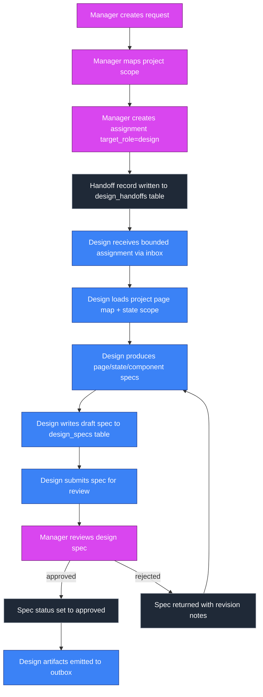

# Design Handoff Flow

```mermaid
flowchart TD
    classDef manager fill:#d946ef,stroke:#701a75,color:#fff
    classDef design fill:#3b82f6,stroke:#1e3a8a,color:#fff
    classDef object fill:#1f2937,stroke:#9ca3af,color:#fff

    A[Manager creates request]:::manager --> B[Manager maps project scope]:::manager
    B --> C[Manager creates assignment target_role=design]:::manager
    C --> D[Handoff record written to design_handoffs table]:::object
    D --> E[Design receives bounded assignment via inbox]:::design
    E --> F[Design loads project page map + state scope]:::design
    F --> G[Design produces page/state/component specs]:::design
    G --> H[Design writes draft spec to design_specs table]:::design
    H --> I[Design submits spec for review]:::design
    I --> J[Manager reviews design spec]:::manager
    J -->|approved| K[Spec status set to approved]:::object
    J -->|rejected| L[Spec returned with revision notes]:::object
    L --> G
    K --> M[Design artifacts emitted to outbox]:::design
```
