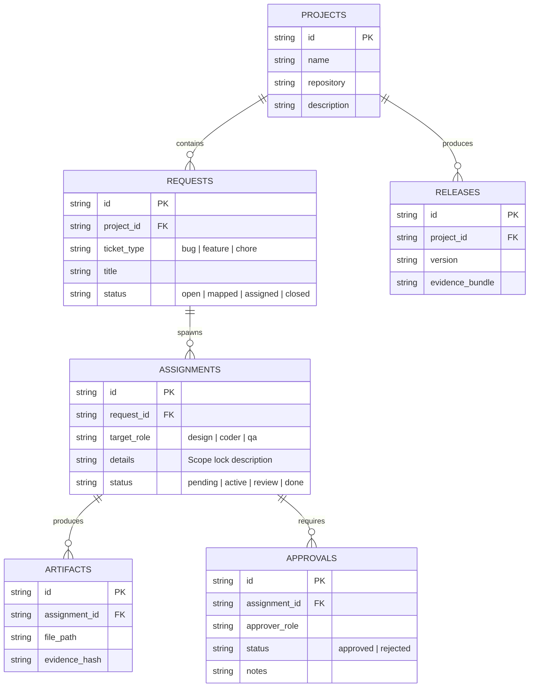

# Dev Backoffice Model

```mermaid
erDiagram
    PROJECTS ||--o{ REQUESTS : "contains"
    PROJECTS ||--o{ RELEASES : "produces"
    REQUESTS ||--o{ ASSIGNMENTS : "spawns"
    ASSIGNMENTS ||--o{ ARTIFACTS : "produces"
    ASSIGNMENTS ||--o{ APPROVALS : "requires"

    PROJECTS {
        string id PK
        string name
        string repository
        string description
    }

    REQUESTS {
        string id PK
        string project_id FK
        string ticket_type "bug | feature | chore"
        string title
        string status "open | mapped | assigned | closed"
    }

    ASSIGNMENTS {
        string id PK
        string request_id FK
        string target_role "design | coder | qa"
        string details "Scope lock description"
        string status "pending | active | review | done"
    }

    ARTIFACTS {
        string id PK
        string assignment_id FK
        string file_path
        string evidence_hash
    }

    APPROVALS {
        string id PK
        string assignment_id FK
        string approver_role
        string status "approved | rejected"
        string notes
    }

    RELEASES {
        string id PK
        string project_id FK
        string version
        string evidence_bundle
    }
```
