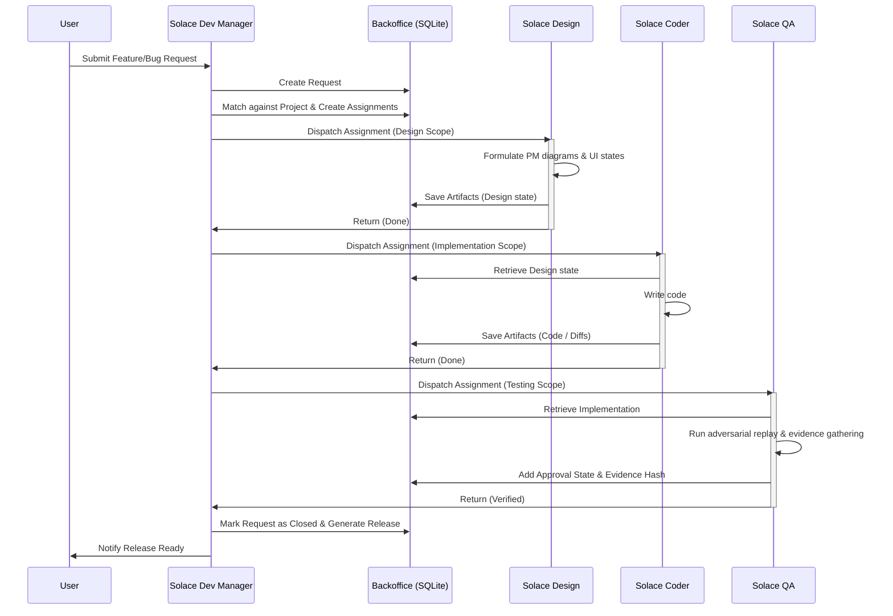

# Dev Request to Release

```mermaid
sequenceDiagram
    participant User
    participant DevManager as Solace Dev Manager
    participant Backoffice as Backoffice (SQLite)
    participant Design as Solace Design
    participant Coder as Solace Coder
    participant QA as Solace QA

    User->>DevManager: Submit Feature/Bug Request
    DevManager->>Backoffice: Create Request
    DevManager->>Backoffice: Match against Project & Create Assignments

    DevManager->>Design: Dispatch Assignment (Design Scope)
    activate Design
    Design->>Design: Formulate PM diagrams & UI states
    Design->>Backoffice: Save Artifacts (Design state)
    Design->>DevManager: Return (Done)
    deactivate Design

    DevManager->>Coder: Dispatch Assignment (Implementation Scope)
    activate Coder
    Coder->>Backoffice: Retrieve Design state
    Coder->>Coder: Write code
    Coder->>Backoffice: Save Artifacts (Code / Diffs)
    Coder->>DevManager: Return (Done)
    deactivate Coder

    DevManager->>QA: Dispatch Assignment (Testing Scope)
    activate QA
    QA->>Backoffice: Retrieve Implementation
    QA->>QA: Run adversarial replay & evidence gathering
    QA->>Backoffice: Add Approval State & Evidence Hash
    QA->>DevManager: Return (Verified)
    deactivate QA

    DevManager->>Backoffice: Mark Request as Closed & Generate Release
    DevManager->>User: Notify Release Ready
```
