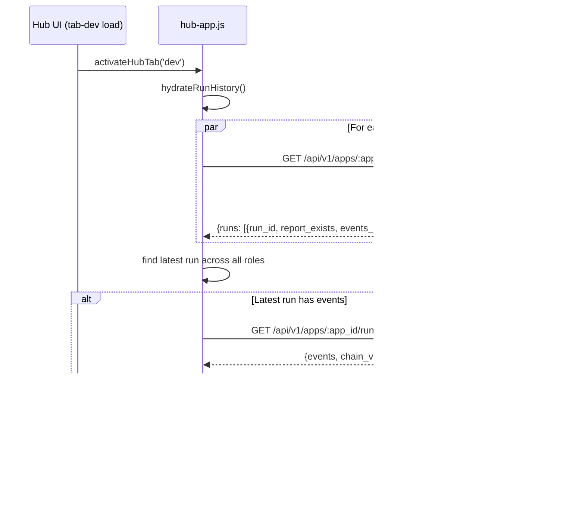

# Durable Last-Known Run State Flow

Governs: how the Dev workspace recovers and displays run state on tab load.

```mermaid
sequenceDiagram
    participant U as Hub UI (tab-dev load)
    participant JS as hub-app.js
    participant RT as solace-runtime

    U->>JS: activateHubTab('dev')
    JS->>JS: hydrateRunHistory()

    par For each role (x4)
        JS->>RT: GET /api/v1/apps/:app_id/runs
        RT->>RT: scan outbox/runs/ directory
        RT-->>JS: {runs: [{run_id, report_exists, events_exist, modified}...], count}
    end

    JS->>JS: find latest run across all roles

    alt Latest run has events
        JS->>RT: GET /api/v1/apps/:app_id/runs/:run_id/events
        RT-->>JS: {events, chain_valid}
        JS->>U: populate #dev-run-inspection with last-known run
    end

    JS->>U: populate #dev-run-history with per-role run lists
    JS->>U: update #dev-last-run badge with latest known run
```
