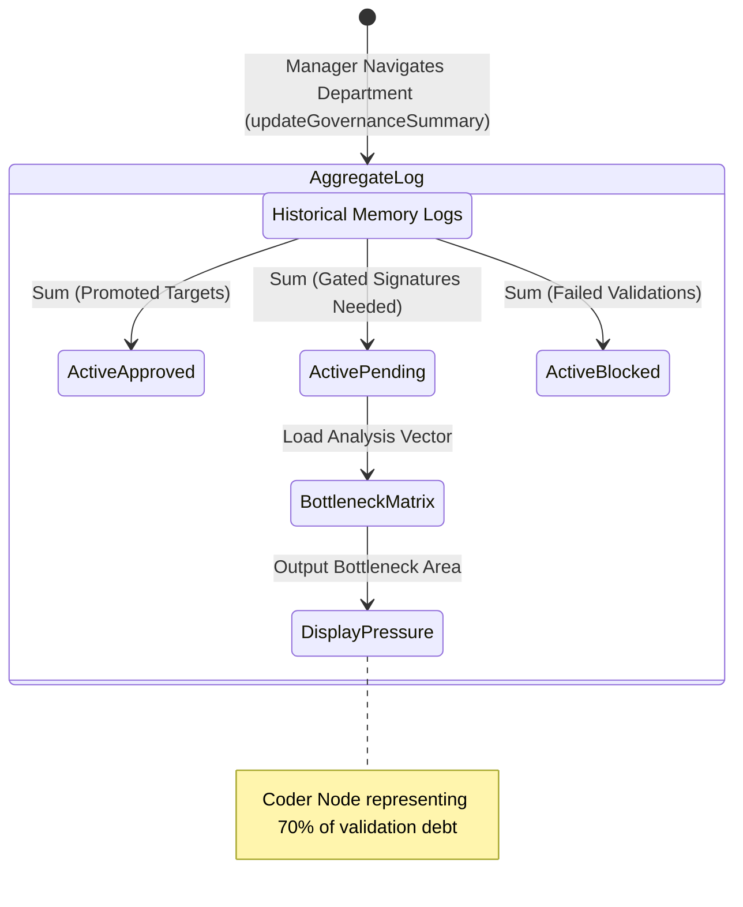

<!-- Diagram: 24-cpu-swarm-node-architecture -->
---
target_schema: prime-mermaid-v1
confidence: verification_gated
author: Grace Hopper (QA Diagrammer constraints)
description: Formal topology tracking department-level governance oversight (manager loading mechanics) mapped dynamically from raw promotion tickets.
context_paper: SI18 Transparency as a Product Feature
---

# Structure: Department Governance Summary

The pipeline aggregates dynamic memory bounds evaluating overall execution debt (Phuc Forecast bounds). O(N) packet tracking summarizes cleanly into O(1) departmental load.

## State Dictionary
- `AggregateLog`: The chronological ledger (SAT28) summarized into real-time metrics.
- `ActiveApproved / Pending / Blocked`: Real counts of pipeline flow status.
- `BottleneckMatrix`: The algorithm isolating which explicit execution lane (Coder, QA, etc) requires the highest sequence of HITL (Human-in-the-Loop) oversight pressure currently.
