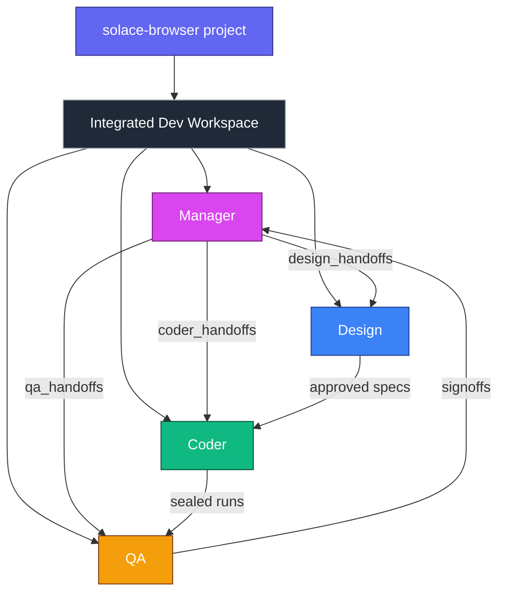

# Integrated Dev Workspace

Governs: the combined workspace shell that surfaces all four roles around a shared project context.

```mermaid
graph TD
    classDef proj fill:#6366f1,stroke:#312e81,color:#fff
    classDef role fill:#1f2937,stroke:#9ca3af,color:#fff
    classDef mgr fill:#d946ef,stroke:#701a75,color:#fff
    classDef dsn fill:#3b82f6,stroke:#1e3a8a,color:#fff
    classDef cod fill:#10b981,stroke:#064e3b,color:#fff
    classDef qa fill:#f59e0b,stroke:#78350f,color:#fff

    Project["solace-browser project"]:::proj
    Workspace["Integrated Dev Workspace"]:::role

    Project --> Workspace
    Workspace --> Manager["Manager"]:::mgr
    Workspace --> Design["Design"]:::dsn
    Workspace --> Coder["Coder"]:::cod
    Workspace --> QA["QA"]:::qa

    Manager -->|design_handoffs| Design
    Manager -->|coder_handoffs| Coder
    Manager -->|qa_handoffs| QA
    Design -->|approved specs| Coder
    Coder -->|sealed runs| QA
    QA -->|signoffs| Manager
```
