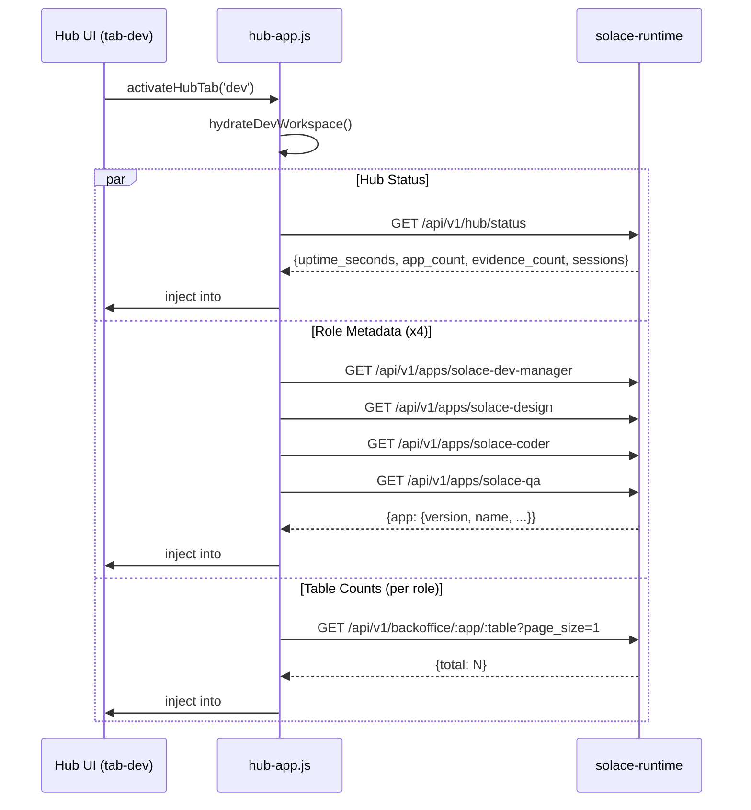

# Live Workspace Hydration Flow

Governs: how the Dev workspace fetches and renders live state from runtime APIs on tab activation.

```mermaid
sequenceDiagram
    participant U as Hub UI (tab-dev)
    participant JS as hub-app.js
    participant RT as solace-runtime

    U->>JS: activateHubTab('dev')
    JS->>JS: hydrateDevWorkspace()

    par Hub Status
        JS->>RT: GET /api/v1/hub/status
        RT-->>JS: {uptime_seconds, app_count, evidence_count, sessions}
        JS->>U: inject into #dev-live-status
    and Role Metadata (x4)
        JS->>RT: GET /api/v1/apps/solace-dev-manager
        JS->>RT: GET /api/v1/apps/solace-design
        JS->>RT: GET /api/v1/apps/solace-coder
        JS->>RT: GET /api/v1/apps/solace-qa
        RT-->>JS: {app: {version, name, ...}}
        JS->>U: inject into #role-live-*
    and Table Counts (per role)
        JS->>RT: GET /api/v1/backoffice/:app/:table?page_size=1
        RT-->>JS: {total: N}
        JS->>U: inject into #live-count-*-*
    end
```
