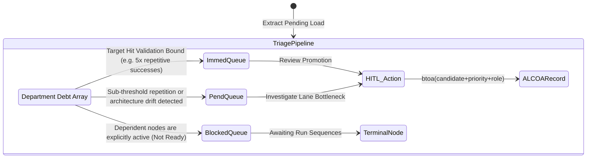

<!-- Diagram: 24-cpu-swarm-node-architecture -->
---
target_schema: prime-mermaid-v1
confidence: verification_gated
author: Grace Hopper (QA Diagrammer constraints)
description: Formal topology detailing the triage of governance load into explicit, actionable Human-in-the-Loop workflows. Prioritization mapping strictly ties candidate evaluation needs against bounded managerial capacity.
context_paper: SI17 Human-in-the-Loop
---

# Structure: Manager Action Queue

Transitioning from O(1) departmental load constraints (SAG29 Governance Summary) into explicit iteration operations. The pipeline determines exact next steps (Immediate, Pending, Blocked) mapped directly against executable role signatures enforcing ALCOA records globally per ticket.

## State Dictionary
- `ImmedQueue`: Highest ranking logic trace. Requires human signoff immediately to persist globally.
- `PendQueue`: Human oversight requested to address structural blockages inside specialist limits.
- `BlockedQueue`: Unresolved node cascades preventing safe Human Action.
- `HITL_Action`: Directed procedural command (e.g., 'Review Promotion', 'Investigate Bottleneck').
- `ALCOARecord`: The Phuc Forecast cryptographically stamped audit requirement.
