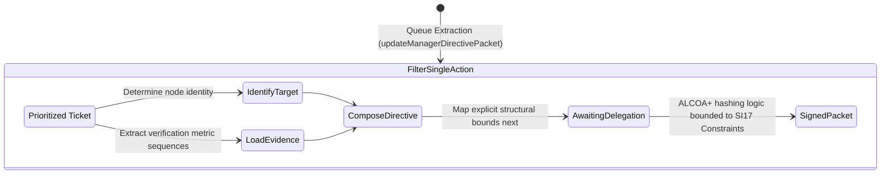

<!-- Diagram: 24-cpu-swarm-node-architecture -->
---
target_schema: prime-mermaid-v1
confidence: verification_gated
author: Grace Hopper (QA Diagrammer constraints)
description: Formal topology translating prioritized macro queues into exact execution directives bounding manager actions with rigid evidence strings and delegation next steps.
context_paper: SI17 Human-in-the-Loop
---

# Structure: Manager Directive Packet

Resolving ambiguity between generalized load (SAG29) and prioritizing action queues (SAA30), evaluating the singular explicit object bounds presented to a manager prior to cryptographic sign-off.

## State Dictionary
- `ActionItem`: The ticket derived from the parent queue.
- `IdentifyTarget`: Tracing action directly to `Coder`, `Design` or explicit execution elements.
- `LoadEvidence`: Providing the exact verification signal blocking manager hallucination (e.g. Test Array Output).
- `AwaitingDelegation`: Formulating the strict action needed (Execution, Isolation, Deferral).
