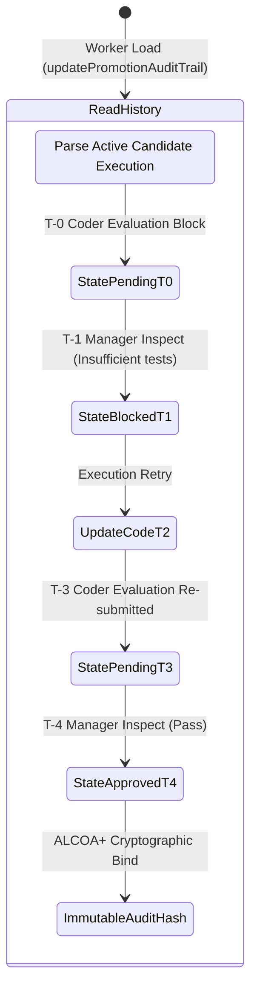

<!-- Diagram: 24-cpu-swarm-node-architecture -->
---
target_schema: prime-mermaid-v1
confidence: verification_gated
author: Grace Hopper (QA Diagrammer constraints)
description: Formal representation of the SAT28 Promotion Audit Trail pipeline. Exposes human validation inputs as a strictly immutable linked sequence over time enforcing SI18 standard transparency matrices.
context_paper: SI18 Transparency as a Product Feature
---

# Structure: Promotion Audit Trail

In compliance with the **Phuc Forecast (Geometric Law)**, this diagram binds ephemeral decisions (SAM27) into an ordered ledger. Each node evaluates dynamically, collapsing O(N) evaluation histories into single verifiable O(1) structures locked via ALCOA+ bounds.

## State Dictionary
- `StatePendingTx`: Evaluated node awaiting gating evaluation. Log tracks chronological timestamps linking candidate `solace-prime-mermaid-coder-vX.x`.
- `StateBlockedTx`: Negative manager evaluation explicitly captured with visible failure vectors.
- `StateApprovedTx`: Promotion authorization generated. Immutable.
- `ImmutableAuditHash`: Output structure resolving the sequence bound into base64 cryptologic strings ensuring evidence cannot be functionally mocked away.
