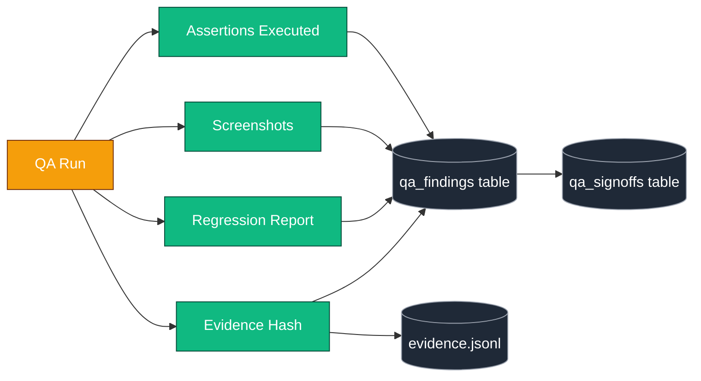

# QA Evidence Flow

```mermaid
flowchart LR
    classDef source fill:#f59e0b,stroke:#78350f,color:#fff
    classDef artifact fill:#10b981,stroke:#064e3b,color:#fff
    classDef store fill:#1f2937,stroke:#9ca3af,color:#fff

    QARun[QA Run]:::source --> Assertions[Assertions Executed]:::artifact
    QARun --> Screenshots[Screenshots]:::artifact
    QARun --> Regressions[Regression Report]:::artifact
    QARun --> EvidenceHash[Evidence Hash]:::artifact

    Assertions --> QAFindings[(qa_findings table)]:::store
    Screenshots --> QAFindings
    Regressions --> QAFindings
    EvidenceHash --> QAFindings
    EvidenceHash --> EvidenceLog[(evidence.jsonl)]:::store
    QAFindings --> Signoff[(qa_signoffs table)]:::store
```
