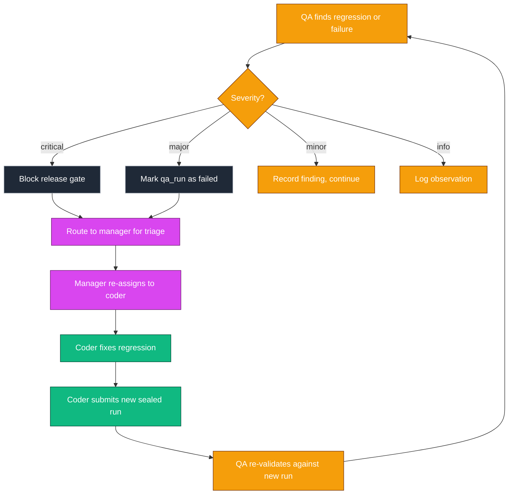

# QA Regression and Failure Routing

```mermaid
flowchart TD
    classDef qa fill:#f59e0b,stroke:#78350f,color:#fff
    classDef coder fill:#10b981,stroke:#064e3b,color:#fff
    classDef manager fill:#d946ef,stroke:#701a75,color:#fff
    classDef object fill:#1f2937,stroke:#9ca3af,color:#fff

    A[QA finds regression or failure]:::qa --> B{Severity?}:::qa
    B -->|critical| C[Block release gate]:::object
    B -->|major| D[Mark qa_run as failed]:::object
    B -->|minor| E[Record finding, continue]:::qa
    B -->|info| F[Log observation]:::qa

    C --> G[Route to manager for triage]:::manager
    D --> G
    G --> H[Manager re-assigns to coder]:::manager
    H --> I[Coder fixes regression]:::coder
    I --> J[Coder submits new sealed run]:::coder
    J --> K[QA re-validates against new run]:::qa
    K --> A
```
