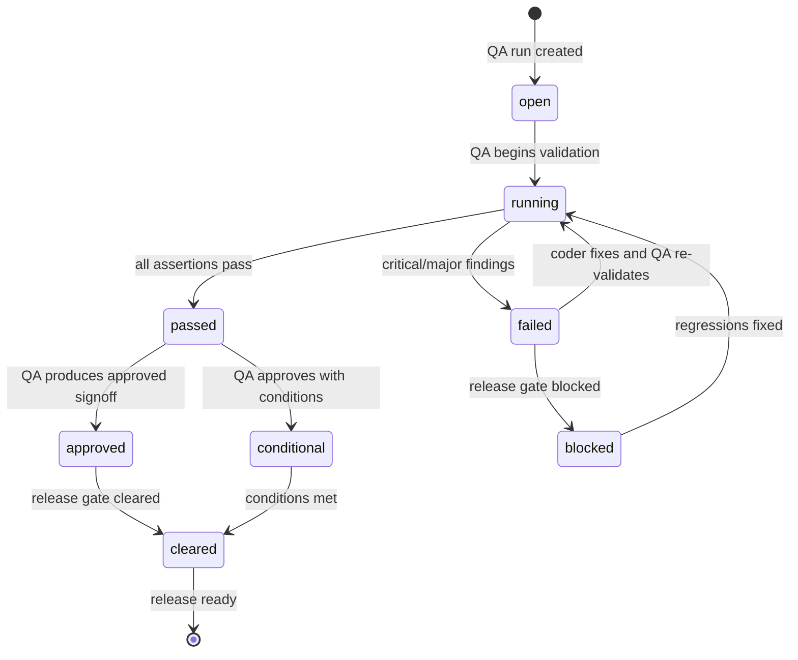

# QA Signoff and Release Gate

```mermaid
stateDiagram-v2
    [*] --> open : QA run created
    open --> running : QA begins validation
    running --> passed : all assertions pass
    running --> failed : critical/major findings
    failed --> running : coder fixes and QA re-validates
    passed --> approved : QA produces approved signoff
    passed --> conditional : QA approves with conditions
    approved --> cleared : release gate cleared
    conditional --> cleared : conditions met
    failed --> blocked : release gate blocked
    blocked --> running : regressions fixed
    cleared --> [*] : release ready
```
