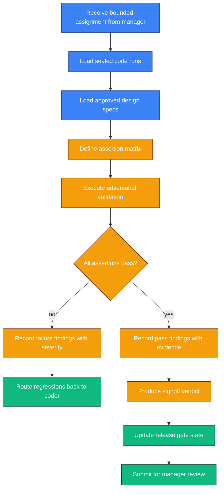

# QA Workflow

```mermaid
flowchart TD
    classDef qa fill:#f59e0b,stroke:#78350f,color:#fff
    classDef input fill:#3b82f6,stroke:#1e3a8a,color:#fff
    classDef output fill:#10b981,stroke:#064e3b,color:#fff

    A[Receive bounded assignment from manager]:::input --> B[Load sealed code runs]:::input
    B --> C[Load approved design specs]:::input
    C --> D[Define assertion matrix]:::qa
    D --> E[Execute adversarial validation]:::qa
    E --> F{All assertions pass?}:::qa
    F -->|yes| G[Record pass findings with evidence]:::qa
    F -->|no| H[Record failure findings with severity]:::qa
    H --> I[Route regressions back to coder]:::output
    G --> J[Produce signoff verdict]:::qa
    J --> K[Update release gate state]:::output
    K --> L[Submit for manager review]:::output
```
